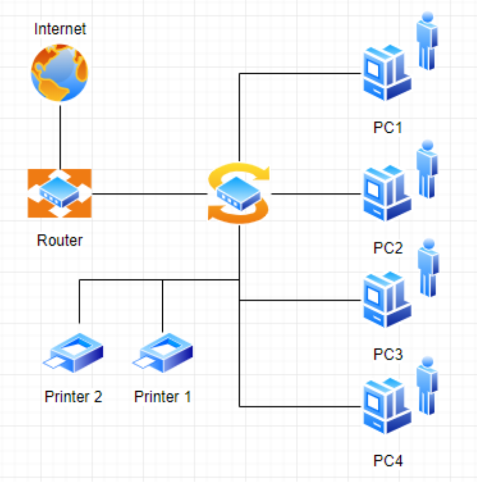
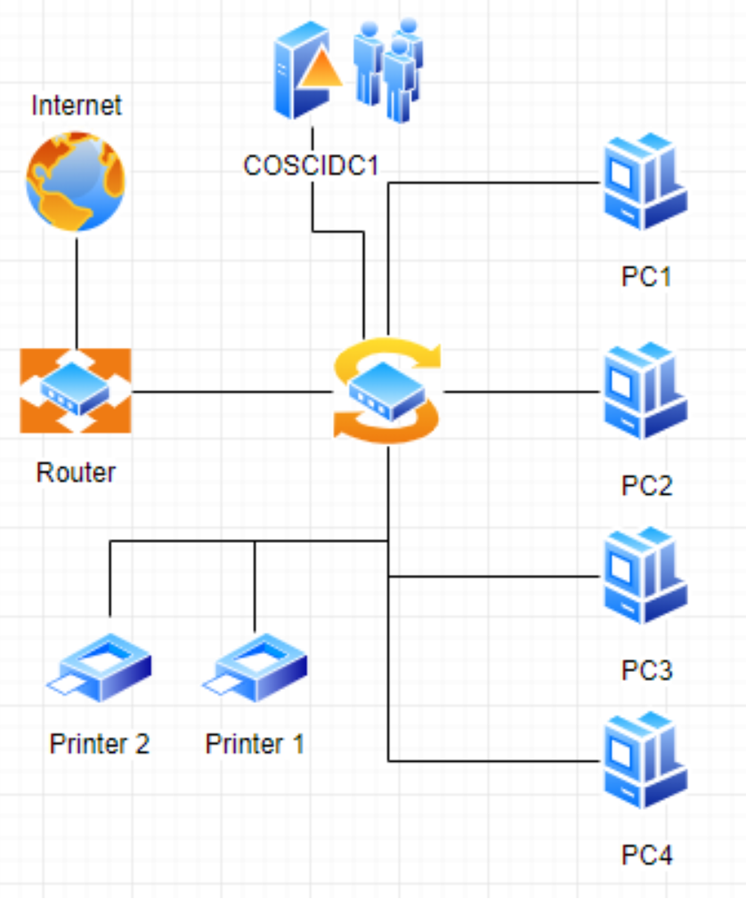
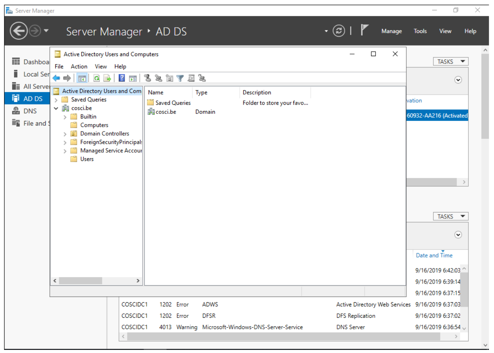
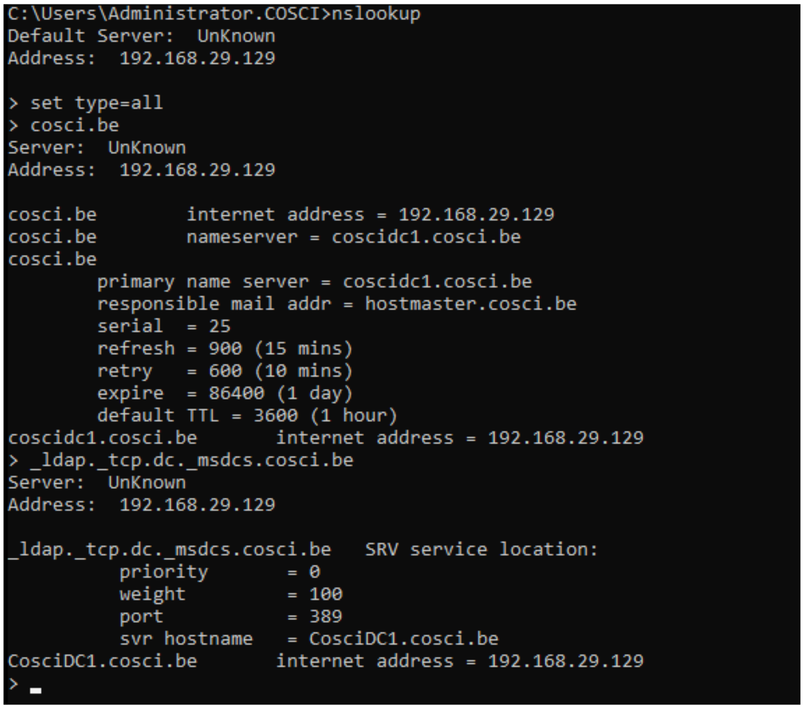
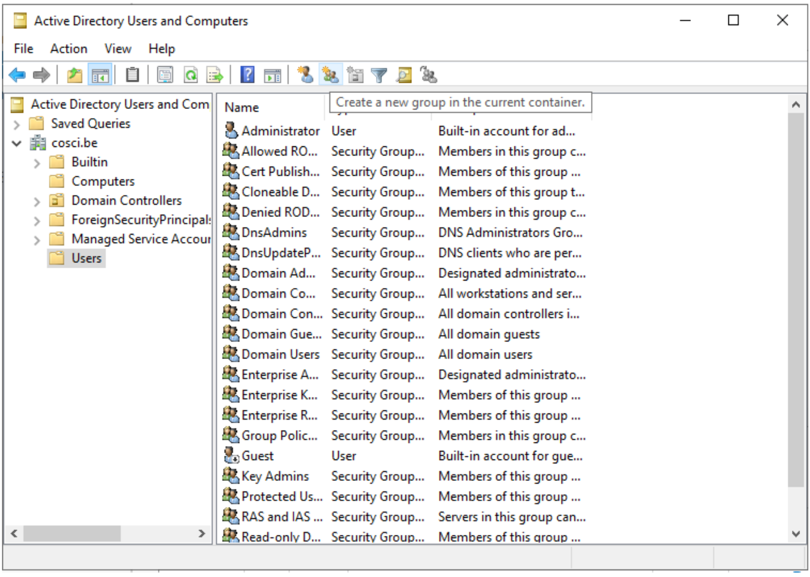

# Active Directory

## Virtual Box Setup

In dit labo gaan we 3 virtuele machines opzetten in een virtueel netwerk in VirtualBox, namelijk een Windows 10 machine en 2 Windows Server 2019 machines. Dan gaan we ADDS installeren op één van deze servers.

### VirtualBox Installatie

De installer kan je downloaden via: https://www.virtualbox.org/ > Download VirtualBox.

Afhankelijk van jou besturingssysteem zal je op deze pagina een bepaalde download moeten kiezen. Voor Windows gebruikers kan je `Windows hosts` downloaden.

Voor Unix en MacOS gebruikers moeten jullie eens nakijken of er ondersteuning is voor VirtualBox op jouw systeem. Zelfs al kan je VirtualBox installeren kan achteraf blijken bij de installatie van Windows VMs dat jouw systeem niet Windows kan virtualizeren. Indien dit bij jouw het geval is, laat dit zeker weten en kunnen we kijken naar een cloud oplossing.

### Virtueel Netwerk

* Open Host Network Manager onder: File > Host Network Manager
* Maak een nieuw netwerk
* Pas de eigenschappen aan van dit netwerk
    * Adapter settings
        * IPv4 Address: 10.10.10.1
        * Network Mask: 255.255.255.0
    * DHCP Server
        * Server Address: 10.10.10.1
        * Server Mask: 255.255.255.0
        * Lower Address Bound: 10.10.10.2
        * Upper Address Bound: 10.10.10.254 

### ISO Files

* Download de Windows 10 en Windows Server 2019 ISO's van [Academic Software](https://www.academicsoftware.eu/)
    * Dit kan best traag zijn, kijk de note hieronder
    * Licenties voor jouw machines kan je ook aanvragen, maar dit is niet nodig aangezien deze lang genoeg functioneel zullen zijn zonder licenties voor dit semester.
* Verplaats deze 2 ISO's naar een folder op de PC, liefst op een schijf waarop je veel plaats hebt, zoals ik veel plaats heb op D schijf zet ik dit in een folder `D:\VirtualBox`. In deze folder gaan we ook onze VM's zetten.

> Als je geen toegang hebt tot academic software of het gaat veel te lang duren, kan je de ISO's ook downloaden van http://webfiles.ucll.be. Je vindt de ISO’s in de directory Education\CourseInfo\Management en Technologie\Management Leuven\Toegepaste Informatica\1TI\Besturingssystemen_1\ISOs

### Virtual Box Windows 10

* In VirtualBox, maak een nieuwe VM aan met 'New'. Deze gaan we gebruiken voor Windows 10. 
    * Ga in Export Mode, geef je VM een naam, bijvoorbeeld `Win10`. 
    * Kies een folder waarin je deze VM zal zetten, ik raad aan de folder van de stap hierboven te gebruiken naast je ISO's zodat je voldoende plaats hebt. 
    * Selecteer dan Microsoft Windows en Windows 10 (64-bit) en geef deze VM 4 GB (4096 MB) Memory. 
    * Selecteer 'Create a virtual hard disk now' en dan op 'Create'. Geef dan je VM 60 GB geheugen, dit neemt niet meteen 60 GB af van je harde schijf, dit is een limiet. 
    * En dan tenslotte klik je op 'Create'.
* We gaan enkele eigenschappen van de VM aanpassen, ga in de settings van je Windows 10 VM en pas aan:
    * System > Motherboard
        * Deactiveer Floppy
    * System > Processor
        * Geef de VM 2 CPUs
    * Network > Adapter 1
        * Attached to: Host-only Adapter
        * Name: je aangemaakte virtueel netwerk (VirtualBox Host-Only Ethernet Adapter #2)
    * Storage
        * Selecter Empty (Optical Drive)
        * Klik rechts vanboven op het disk icoontje
        * Choose a disk file ...
        * Selecteer je Windows 10 education ISO
* Start de VM op en bij de eerste startup zal je nog eens je ISO file moeten selecteren die er als optie tussen staat.
* Werk de Windows installatie verder af
    * Laat alles staan op US behalve keyboard en input zet je naargelang je toetsenbord layout.
        * Standaard QWERTY is US
        * Standaard AZERTY is Belgian (Comma)
    * Install Now
    * Custom: Install Windows Only
    * Next
    * Selecteer als Region Belgium
    * Selecteer je keyboard layout opnieuw
    * Disable alle features
    * Kies tenslotte een Login als Win10 en p@ssw0rd

> Als je VM heel traag is: probeer eens het volgende commando `bcdedit /set hypervisorlaunchtype off` en herstart je PC

### Virtual Box Windows 2019

* Herhaal nu dezeflde stappen als met Windows 10 om nu de 2 Window Server 2019 machines te maken. Een paar zaken die nog anders zijn tegenover de Windows 10 installatie zijn:
    * Geef deze VM's een unieke naam. De ene server is de primary domain controller en de andere is een backup server. Ik gaf deze servers de namen `ServerDC` en `ServerBU`.
    * Windows 2019 (64-bit) selecteren
    * Hierbij zal je de andere ISO file moeten gebruiken
    * Bij windows installatie, selecteer de Windows Server 2019 Standard (Desktop Experience)

## cosci.be perspectief

Een hogeschool, dat we nu de naam cosci geven, heeft op dit moment een 70-tal Windows PC's.

Hieronder een schema zoals het schoolnetwerk er momenteel uitziet. Eén router is met het internet verbonden, aan die router is een switch verbonden en aan die switch hangen een heleboel PC's en printers.

Iedere keer dat er een nieuw computerlokaal wordt opgemaakt, moet de ICT-afdeling de nieuwe PCs opzetten, op elke PC een Windows account aanmaken en deze gaan plaatsen in het lokaal. Nu moet er nog opgelijst worden welke login voor elke PC van toepassen is om zo deze PC te kunnen gebruiken.

Wanneer de school nieuwe regels oplegt, bijvoorbeeld een vaste achtergrond afbeelding plaatsen, moeten ze elke PC opnieuw afgaan en deze regel toepassen. Iedere keer wanneer een lijst met logins verloren gaat, moet een administrator op alle PC's waarop deze logins werken, aanmelden met het Administrator-account en de login lokaal op de PC veranderen.

De ICT-afdeling heeft gehoord dat dit efficiënter kan door de PC's aan een **Active Directory-server** te koppelen, waarop ze alle PC's en gebruikers vanop één centrale plaats kunnen beheren. Ook het beheer van printers en PC-instellingen zouden eenvoudiger via dit Active Directory kunnen verlopen.

> NOTE: Active Directory bestaat uit meer dan alleen een Active Directory Domain Controller. Voor de eenvoud van dit labo gaan we er van uit dat een Windows Domain hetzelfde is als een Active Directory Domain of een Domain en dat dit Domain wordt beheerd of invulling krijgt door middel van een Domain Controller die, ook wel Active Directory Domain Controller genoemd. Aan de UCLL wordt Active Directory bijvoorbeeld gebruikt, zodat jullie in de PC-klassen op gelijkwelke computer kunnen inloggen met jullie gebruikersnaam. Alle computers van de PC-klas zitten in het UCLL-domein, en wanneer je inlogt op één van die computers worden je gegevens gecontroleerd door de domain controller.

## Windows Domein

Om te beginnen aan dit labo moeten we eerst begrijpen wat een Windows Domain is. Een Windows Domain is een logisch netwerk, waarin alle user-accounts, computers, printers, netwerkschijven, ... geregistreerd zijn op een centrale server, de Active Directory Domain Controller. Doordat alles centraal geregistreerd is, kunnen we het ook centraal beheren. Dit geeft ons een heleboel mogelijkheden:

* Gecentraliseerd gebruikersbeheer: alle gebruikersaccounts worden bijgehouden op de server, niet op de client PC's
* We kunnen op de server de toegang beperken voor welke users aan welke resources (printers, netwerkshares, ...) kunnen.
* Gemakkelijk te schalen wanneer het aantal gebruikers en PC's groter wordt

> In dit labo gaan we een Active Directory Domain Controller installeren, een PC toevoegen aan het domein, gebruikers aanmaken op de Domain Controller die we dan laten aanmelden op de PC.

## Windows Server Manager
### Rollen
Een Windows Server wordt doorgaans geconfigureerd via Windows Server Manager, een programma dat standaard geïnstalleerd is op alle installaties van Windows Server. Met deze tool kan je een heleboel extra "componenten" op je server installeren, zoals Active Directory, een DHCP server, een Fax-server, ... . Deze componenten noemen we _Roles_, de "primaire" programma's.

### Features
Daarnaast kan je ook features installeren. Features zijn programma's of add-ons die niet zozeer impact hebben op de functionaliteit van de primaire programma's, maar extra functies voorzien. Een heel bekende feature is PowerShell, de bekende scripting-taal van Microsoft.

## Installatie Active Directory
Zoals besproken worden in een Domein alle gebruikersaccounts, PC's, printers, ... centraal bijgehouden. De databank of database waarin deze worden opgeslagen noemen we een 'Directory'. Er zijn een heleboel Directory-softwarepakketten (OpenLDAP, Samba, FreeIPA, 389 Directory Server, ...) maar verreweg de meest gebruikte is en blijft Windows Active Directory.

Deze kunnen we natuurlijk heel eenvoudig installeren op onze Windows Server ServerDC.

### Voorbereiding
Eerst en vooral gaan we de server een logische naam geven. Open **Server Manager** en ga naar **Local Server**. Klik op de computernaam, vervolgens op 'Change...'. Geef de server de naam 'COSCIDC1'. Om die wijzigingen door te voeren moet je de server opnieuw opstarten.

Stel ook een statisch IP in. Hiervoor neem je best het IP dat door de DHCP-server van VirtualBox is toegekend aan je server, samen met het subnet-mask en de default-gateway.

> TIP: Je kan uiteraard altijd [op het internet rekenen](https://lmgtfy.com/?q=windows+server+2019+set+static+ip) om te ontdekken hoe dit moet.

### Installatie
1. Klik in Server Manager op "Manage" rechtsbovenaan en selecteer "Add Roles and Features".
2. Bij Installation Type kies je voor "Role-based or feature-based installation".
3. Onder "Server Roles" kies je voor "Active Directory Domain Services", het belangrijkste onderdeel van Active Directory. Pas als dit onderdeel op de server geïnstalleerd is, spreken we van een Domain Controller.
4. Loop verder door de installatie. Deze begint vanzelf. Wanneer de installatie gedaan is krijg je de melding "Configuration required". Klik door op "Promote this server to Domain Controller". Je krijgt een venster "Deployement configuration."
5. Gezien dit onze eerste Domain Controller is, willen we een nieuwe forest maken. Er wordt gevraagd om een "Root domain name". Die is in ons geval `cosci.be`, de domeinnaam waarvan we willen vertrekken voor de rest van onze domeinen.
6. In Domain Controller laten we Domain Name System (DNS) server aangevinkt. Dit zal automatisch een DNS-server installeren voor het domein `cosci.be`.
7. Onder additional options laten we de NetBIOS domain name staan op 'COSCI'. Dit is een verkorte naam waarmee we later kunnen verwijzen naar het domein.
8. Loop verder door de installer. De server moet herstart worden nadat de installatie voltooid is.

### Controle
Als je alle stappen hebt gevolgd, heb je nu een Active Directory server geïnstalleerd, met als root-domain `cosci.be`. Daarnaast is er ook automatisch een DNS-server geïnstalleerd, met de juiste records voor `cosci.be`. Om dit na te gaan openen we het programma "Active Directory Users and Computers". Als je alles goed gedaan hebt zie je `cosci.be` als domein staan.

## Een computer opnemen in een domein

Om communicatie tussen de twee machines mogelijk te maken zal je **Windows Device Discovery en File Sharing** moeten aanzetten. Door dit te doen, worden bepaalde poorten op de firewall opengezet, die belangrijk zijn voor het delen van bestanden en informatie voor Windows-machines. De gemakkelijkste manier is om de verkenner te openen en naar 'Network' te gaan. Er verschijnt bovenaan een gele balk die meldt dat device discovery uitstaat. Je kan deze aanzetten door er op te klikken. Dit moet je uiteraard op beide machines doen. **Test hierna of de twee machines elkaar kunnen pingen**.

> TIP: `cmd`, `ipconfig`, `ping`

### Aan de slag

Active  Directory  gebruikt  het  DNS-protocol om aan client pc’s door te geven welke server de domain controller  is. Bij  de  installatie  van  de  Active  Directory  rol  op  de  server,  gaat  automatisch  ook  de  DNS server rol mee geïnstalleerd worden. Als we willen dat de client computers nu het domein dat we aangemaakt hebben kunnen vinden, dan moeten we dus de DNS-settings op die client eerst juist instellen. Open op de Windows 10 client machine  de netwerkeigenschappen (waar je het IP-adres van de client ingesteld hebt), en stel het IP-adres van de DNS server in op het IP-adres van de Windows Server machine.

De Windows10-computer **kan dan pas** opgenomen worden als cliënt in het domein. Klik op Verkenner→rechter klik op This PC→Properties→Change Settings→Change. Om een computer toe te voegen aan een domein moet je wel over enige rechten beschikken:

* Op de machine die men opneemt, moet men beheerdersrecht (Administrator) hebben.
* Als men de machine wil toevoegen aan een domein, moet men de naam en het paswoord kunnen opgeven van een account van het domein die het recht heeft om computers in het domein op te nemen (bvb. de Domein Administrator).

Geef je de PC een logische naam, en als domeinnaam geef je `cosci.be` in. Wanneer er een gebruikersnaam en wachtwoord gevraagd wordt, geef je de gegevens van de beheerder van de server op (Administrator:p@ssw0rd). Hierna zou je een welkomstberichtje moeten krijgen. Start de computer opnieuw op.

> NOTE:  Na herstarten kan men met 2 soorten accounts inloggen: de accounts die lokaal op de pc gedefinieerd waren (en blijven) en de accounts die globaal (d.i. op het domein) gedefinieerd zijn. (Momenteel hebben we er nog geen globaal account aangemaakt)

### Wat gebeurt hier nu eigenlijk als een client opgenomen wordt in een domein?

Doordat we op de Windows 10 client onze Windows Server als DNS-server hebben ingesteld, worden alle DNS-queries van de client naar de server gestuurd. Op de server werd een DNS-server geïnstalleerd toen we de Active Directory installeerden, dus onze server kan op die queries ook antwoorden.

Toen we in de Windows 10 client `cosci.be` als domein opgaven, ging de PC dus een DNS-query uitsturen voor `cosci.be`, naar onze server. Deze DNS-query is echter een beetje speciaal, hij zoekt namelijk niet gewoon naar het IP-adres van het domein, maar naar een heel specifiek record, een **SRV-record**.

Een SRV-record is een record in DNS waarin je een bepaalde service beschrijft, alsook het ip-adres, de poort, en de priority van deze service. Hieronder zie je de afdruk van een NSLookup.

Wanneer we een client opnemen in het domein `cosci.be` wordt er een query gedaan naar `ldap._tcp.dc._msdcs.cosci.be`, en de client krijgt als antwoord het IP en de poort waar het domeinregistratieproces op draait. Test dit zeker zelf ook eens uit.

> TIP: NSLookup is een tool die je veel nodig gaat hebben voor het opsporen van problemen. Het volledige commando hier uitleggen met al zijn opties is omslachtig. De help-functie en Google zijn uw vriend.

## Gebruikers aanmaken in het domein

De volgende stap is om gebruikers aan te maken in het domein. Hiervoor gaan we terug naar de server en openen we de **Active Directory Users and Computers**-tool (ADUC) (ook onder Windows Administrative Tools). Als je de tab cosci.be openklikt, zie je een aantal voorgemaakte mapjes staan. Als je op Computers klikt, zal je de PC die we zonet hebben opgenomen, zien staan. Als je op Users klikt zie je een heleboel voorgemaakte groepen en enkele users. In deze map willen we een nieuwe groep maken, met de naam 'System Administrators'.

We laten de Group Scope op global staan, en als Group-type kiezen we Security.

Daarna maken we een nieuwe user of gebruiker aan, waar je je eigen gegevens mag invullen. Als User logon name mag je in principe invullen wat je wilt, maar het gemakkelijkste is om het formaat voornaam.familienaam te hanteren.
Ten slotte voegen we de user die we net gemaakt hebben toe aan de groep 'System Administrators'. Als je dit allemaal gedaan hebt kan je terug naar de Windows 10 client gaan, klik je op andere gebruiker om met de globale domein user in te loggen.

Bij het inloggen of aanmelden moet men kiezen of men zich als lokale gebruiker of als domeingebruiker aanmeldt. In het begin is dit verwarrend omdat een account met dezelfde naam (bvb. Administrator) zowel lokaal als globaal (= op het domein) kan gedefinieerd zijn en omdat dit andere accounts zijn met andere rechten! Door een  pc  op  te  nemen  in  een  domein,  krijgen  de  domeingebruikers  automatisch rechten  op  de  pc. Omgekeerd echter niet: de lokale gebruikers krijgen niet automatisch rechten op het domein.

Inloggen gaat als volgt:

* lokaal: als `win10\xxx` (als `win10` de naam van de pc is, en `xxx` het lokaal account is)
* globaal: als `cosci\voornaam.familienaam` of `voornaam.familienaam@cosci.be`

# Wat moet je na dit labo minstens kennen/kunnen
* Je kan op een Windows machine de TCP/IP instellingen opvragen en aanpassen (toepassen)
* Je kan AD Domein services installeren op Windows 2019 (toepassen)
* Je kan nieuw AD root domein configureren  (toepassen)
* Je kan gebruikers en groepen aamaken in AD DS (toeapssen)
* Je weet en kan lokaal en gobaal (domein) op een Windows 10 machine inloggen (begrijpen en toepassen)