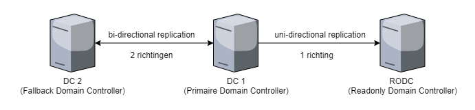
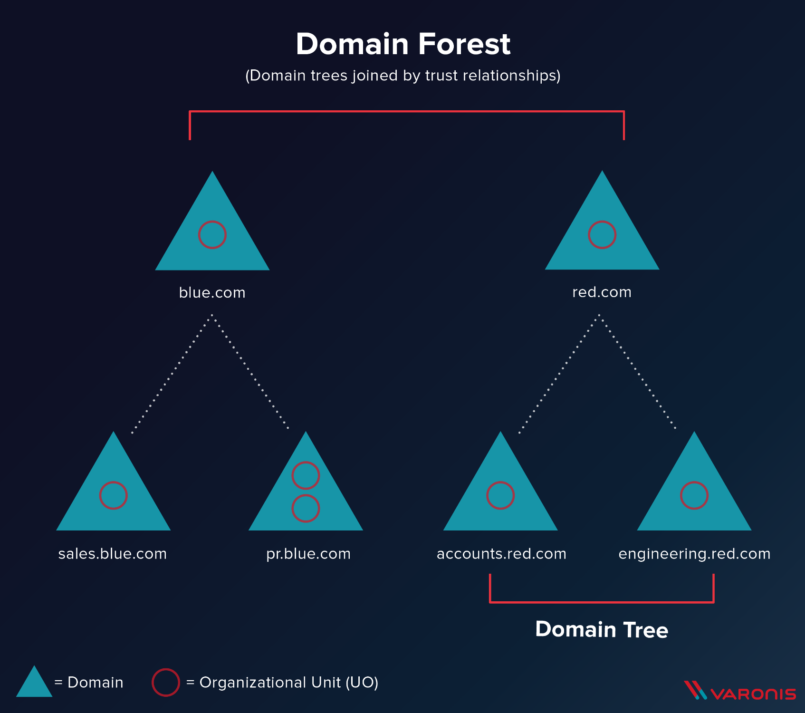
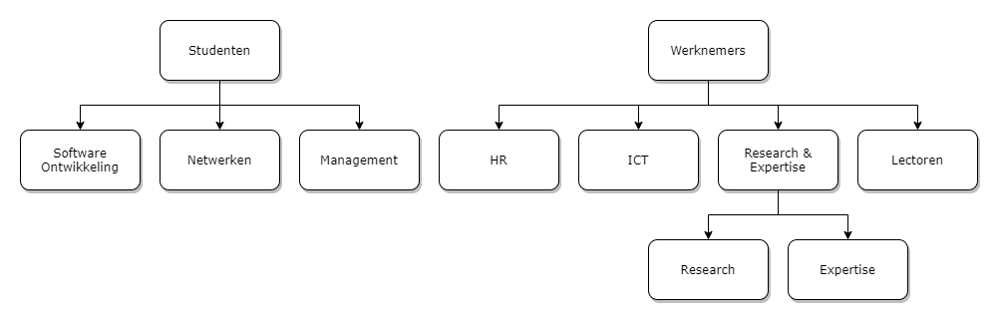

# Active Directory Continued

In het vorige labo hebben we een Single Domain Active Directory opgesteld met 2 Windows 2019 machines en 1 Windows 10 machine. In dit labo gaan we hierop verder door de 2e Windows server op te zetten en in te zetten om de fouttolerantie te verbeteren.

## 1. Fouttolerante Active Directory Domain Services

Een domain waarin maar één DC (Domain Controller) draait, is niet fouttolerant. Zodra die DC uitvalt, is Active Directory niet meer beschikbaar voor het hele netwerk van de organisatie. Daarom is altijd minimaal twee DC's te laten draaien nodig in een domain voor de noodzakelijke bedrijfszekerheid.

Vanaf we 2 DC's hebben op het domain kunnen we de informatie op beide servers gelijk houden met een proces dat replicatie heet. Valt één van de twee DC's weg, dan kan het netwerk alsnog verder functioneren. We laten de tweede server ook DNS installeren waardoor deze ook DNS zal repliceren. Replicatie is vrij eenvoudig. Als er een aanpassing gebeurt op een domain controller, dan wordt deze aanpassingen verwittigd aan de primaire domain controller, deze gaat dan op zijn beurt deze aanpassing uitvoeren en dan zijn state repliceren naar alle andere domain controllers zodat deze allemaal synchroon blijven.

Conflicten tussen aanpassingen komen heel zelden tot nooit voor omdat Active Directory enkel aanpassingen maakt op basis van het laagst mogelijke niveau. Zo kan je op een domain controller het email adres van de user Bob aanpassen en op een andere domain controller op hetzelfde moment het telefoonnummer aanpassen zonder enig conflict. Omdat deze aanpassingen op een verschillend attribuut van deze user neerslaan. Indien ze beide het telefoonnummer aanpassen wint de domain controller met de hoogste versienummer of de laatste timestamp van de aanpassing.

### 1.1. ServerBU - COSCIDC2

Hiervoor ga je eerst je ServerBU machine moet opzetten en instellen.

Eerst en vooral gaan we de server een logische naam geven. Open **Server Manager** en ga naar **Local Server**. Klik op de computernaam, vervolgens op 'Change...'. Geef de server de naam 'COSCIDC2'. Om die wijzigingen door te voeren moet je de server opnieuw opstarten.

Stel ook een statisch IP in. Deze moet binnen de range van je netwerk zijn en mag niet hetzelfde zijn als je primaire DC, de default gateway is het server adres dat je ingesteld hebt in VirtualBox host-only network #2. Je zal ook je DNS moeten aanpassen zodat deze de primaire server kan vinden.

> TIP: Je kan uiteraard altijd [op het internet rekenen](https://lmgtfy.com/?q=windows+server+2019+set+static+ip) om te ontdekken hoe dit moet.

### 1.2. Member Server

Nu gaan we van COSCIDC2 een member server maken van het domain COSCI. Hiervoor zal je primaire Domain Controller ook moeten aanstaan. Laat COSCIDC2 eens pingen naar COSCIDC1, als dit lukt kunnen we verder.

Op COSCIDC2, open **Server Manager** en ga naar **Local Server**. Klik op de computernaam, vervolgens op 'Change...'. Geef dan het domain COSCI in en login met je administrator account. Vanaf nu is deze server deel van het COSCI-domain en is het een member server.

### 1.3. Active Directory

De volgende stap is om van COSCIDC2 een domain controller te maken door ADDS erop te installeren.

1. Klik in Server Manager op "Manage" rechts bovenaan en selecteer "Add Roles and Features".
2. Bij Installation Type kies je voor "Role-based or feature-based installation".
3. Onder "Server Roles" kies je voor "Active Directory Domain Services".
4. Loop verder door de installatie. Deze begint vanzelf. Wanneer de installatie gedaan is krijg je de melding "Configuration required". Klik door op "Promote this server to Domain Controller". Je krijgt een venster "Deployement configuration."
5. Gezien dit de tweede Domain Controller is, bestaat de forest en domain al, en willen we dus deze domain controller toevoegen aan een bestaand domain. Er wordt gevraagd om een "domain name". Die is in ons geval `cosci.be`. Log dan in met het Administrator account van het domain COSCI.
6. Als options laten we Domain Name System (DNS) server aangevinkt. Dit zal automatisch een DNS-server installeren voor het domein `cosci.be`. Global Catalog GC laat je ook aangevinkt, dit is de database van Active Directory. Read Only Domain Controller (RODC) laten we uit. Tenslotte vul je een paswoord in.
7. Laat update DNS delegation uitstaan.
8. Bij Additional Options moet je bij Replicate from je primaire server selecteren, COSCIDC1.
9. Loop verder door de installatie. De server moet herstart worden nadat de installatie voltooid is.

### 1.4. Replicatie Controle

Vanaf nu heb je 2 Domain Controllers op je netwerk die ADDS en DNS naar elkaar repliceren.

Als eerste moet je nagaan dat beide servers elkaar kunnen pingen en bereiken, als dit niet het geval is moet je Device Discovery aanzetten in sharing settings.

Kijk na of het replicatie proces werkt. COSCIDC2 zou in het Active Directory Users and Computers nu ook de user van het vorige labo en de groep System Administrators moeten hebben overgenomen.

Maak nu een nieuwe user aan op COSCIDC2 en kijk of deze repliceert naar COSCID1. Maak ook een nieuwe user aan op COSCIDC1 en kijk of deze repliceert naar COSCID2. Dit kan tot 20 seconden duren voordat deze aanpassingen doorkomen.

Als COSCIDC2 niet repliceert naar COSCIDC1 wilt dit zeggen dat COSCIDC1 COSCIDC2 niet kan vinden. Waarschijnlijk is dit omdat je de sharingoptions nog niet goed hebt gezet. Zorg ervoor dat beide servers discoverable zijn op het netwerk en maak aanpassingen aan de user om nog eens het replicatie proces te op te roepen.

### 1.5. Fouttolerantie Controle

Zet alle VMs uit. Ga in Task Manager en end alle tasks dat iets te maken hebben met VirtualBox. Doe je dit niet, dan update de DHCP-server van VirtualBox niet. In VirtualBox, verander de DHCP settings van het Host-only network #2 zodat deze enkel IP-adressen geeft die niet overlappen met jouw servers. Mijn server-IPs zijn 10.10.10.2 en 10.10.10.3, ik heb dus ingesteld dat mijn IP-range start vanaf 10.10.10.4.

Start je Windows PC, login met je lokale account (Win10\Win10), kijk na met `ipconfig` dat deze nu een adres heeft binnen deze range, zo niet gebruik `ipconfig /renew` om deze te vernieuwen. Pas ook je DNS settings aan zodat de **alternate** DNS wijst naar COSCIDC2.

Nu willen we de fouttolerantie testen, hiervoor gaan we alle 3 VMs moeten aanzetten. Als jouw systeem dit niet aankan, mag je deze controle overslaan.
Op mijn 4 cores CPU en 8 GB RAM Computer heb ik alle 3 VMs op 1 CPU en 2 GB geheugen gezet.

Zet alle VMs aan. Login op COSCI. Ping van de Windows PC naar beide servers met behulp van de namen van de servers: `ping COSCIDC1` en `ping COSCIDC2`. Zet de Windows PC af. Zet nu COSCIDC1 af en kijk of je met je Windows 10 machine nog steeds kan inloggen met een andere login op COSCI. Met een andere user inloggen is belangrijk omdat Windows vorige logins bijhoudt.

## 2. Trees en forests

In onderstaande afbeelding stelt iedere blauwe driehoek een Domain voor. Zo zie je dat het bedrijf blue.com een domain heeft met een DC met hun domeinnaam. Hun bedrijf is echter zo groot dat ze ervoor gekozen hebben dit nog verder op te splitsen in subdomeinen. Voor deze subdomeinen hebben ze ook een aparte DC's nodig, en deze gekoppeld aan de bestaande DC voor het blue.com domein. Hierdoor krijg je een soort hiërarchische verhouding en spreken we van een Domain Tree.

Alle resources (PC's, Users, ...) die in een van de subdomeinen worden toegevoegd, zijn in alle subdomeinen beschikbaar dankzij de automatische verbindingen die door de tree wordt gelegd. De voornaamste redenen dat men dit soort architectuur hanteert is als men zeer grote organisaties heeft, trafiek wilt verminderen naar de root DC.

Daarnaast is het ook mogelijk om verschillende trees van verschillende domeinen aan elkaar te koppelen via een trust. Stel bijvoorbeeld dat `blue.com` beslist te gaan samenwerken met `red.com`, dan kan men een trust tussen de 2 trees leggen, waardoor de resources van de ene tree "gekend zijn" in de andere tree. Zo gaan gebruikers van `blue.com` zich zelfs in de gebouwen van `red.com` kunnen aanmelden op de PC's. Voor meer info over design van een Active Directory, lees je dit [artikel](https://mcpmag.com/articles/2010/09/29/ad-design-know-your-domains.aspx).

## 3. Organizational units & groups

### 3.1. Organizational Units

Deze reflecteren vaak de structuur van de organisatie, bijvoorbeeld de OU "Werknemers", waaronder dan de OU "HR", de OU "Sales" en de OU "Engineering" terug te vinden zijn. Ze werken van een grote groep, naar steeds specifiekere groepjes, in een omgekeerd hiërarchisch model. OU's erven altijd de rechten en configuratie over van hun parent, maar kunnen verder gespecificeerd worden. **Ze worden vooral gebruikt om Group Policies op te configureren**. Een gebruiker kan ook maar in 1 van de OU's zitten, en heeft dus alleen effect van de OU waar hij in zit en degene die erboven liggen.

### 3.2. Groepen

Deze hebben minder sterk die hiërarchie, en dienen vooral voor het rechten geven op bepaalde bedrijfsresources (Printers, Mailboxen, ...). Een gebruiker kan wel in meerdere groepen zitten. Ook kunnen groepen genest worden, simpelweg door een groep lid te maken van een andere groep. Alle leden zullen bijgevolg ook door de configuratie van die groep beïnvloed worden.

## 4. User Oefeningen

### 4.1. Guest & Administrator

Als eerste gaan we 2 Users aanpassen: Guest en Administrator users.

Guest is een account die automatisch in ADDS zit als je dit voor het eerst installeert. Deze is bedoeld om gebruikers zonder login toch te kunnen laten inloggen op het systeem met minimale rechten. Op onze hogeschool willen we een guest account maar deze is disabled bij installatie. Ze het guest account op enabled.

Administrator is het omgekeerde van een guest account, dit account heeft alle rechten op het domain en kan overal inloggen. Daarom staan hier vaak ook policies op om bijvoorbeeld paswoorden tijdig te moeten vernieuwen. Als voorbeeld willen we in de hogeschool het paswoord van Administator tijdig vernieuwen, dus gaan we de expiration date van ons paswoord aanpassen.
Zet paswoord expiration van het administrator account aan.

Kijk na of je kan inloggen met het guest account op je Windows PC.

### 4.2. Other Users

Het volgende dat we doen is 2 users aanmaken: Bob Jansens en xtoledo. Bob Jansens is een interim lector bij cosci. xtoledo is een account waarmee studenten hun examens mee kunnen afleggen.

Maak beide users aan maar zorg ervoor dat xtoledo geen paswoord expiration heeft en niet aangepast kan worden en dat Bob zijn paswoord moeten zetten op de volgende login.

- Geef Bob een job title van `Interim Lecturer` in de afdeling `Teaching` bij het bedrijf `Cosci`.
- Vul het mobiel telefoonnummer en het thuisadres in van Bob Jansens.
- Pas de login aan van Bob zodat hij inlogd met bob2@cosci.be want we hebben al een Bob bij cosci.
- Zet de logon hours van Bob zodat hij enkel kan inloggen tussen 7u en 18u en dit enkel van maandag to vrijdag.
- Zorg ervoor dat het account van Bob expires op 31 augustus, vanwege dat dan zijn contract dan stopt bij Cosci.

## 5. Organizational Units en Groepen Oefeningen

### 5.1. Organizational Units Structuur

Probeer nu op de root van het domein de volgende structuur aan te maken met behulp van OU's.

Maak daarnaast in de OU=Users ook de volgende groepen aan.

1. IT-admins
2. Wifi-users
3. BadgeReader-users
4. Employee-administration

En voeg IT-Admins als een groep toe aan Wifi-users. Voeg een user ook toe aan de IT-admins groep en controleer of je daarmee ook toegevoegd bent aan de IT-admins groep.

### 5.2. Organizational Units Locaties

De hoofdlocatie van de hogeschool Cosci is gelegen in Brussel. Kies een adres in Brussel en configureer de Organizational Unit Werknemers zodat zij zich bevinden op deze locatie.

De research & expertise department bevindt zich echter niet op de hoofdlocatie maar bevindt zich in Noord-Mechelen. Configureer de Organizational Unit Research & Expertise zodat deze zich bevindt in Noord-Mechelen. Maak ook een user Marc aan en maak Marc het hoofd in Research.

## 6. Wat moet je na dit labo minstens kennen/kunnen

- Je kan een Windows server toevoegen als member server aan het domain
- Je kan een tweede domain controller opzetten in een bestaand domain met replicatie
- Je weet en kan aan de hand van een duidelijk schema uitleggen wat een domein tree en domein forest is
- Je kan de eigenschappen van gebruikers en groepen binnen AD DS aanpassen
- Je weet en kan uitleggen wat een OU is
- Je kan OU's aanmaken in AD DS
