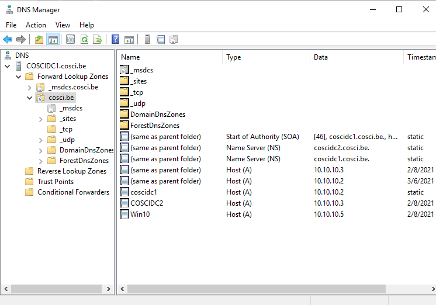
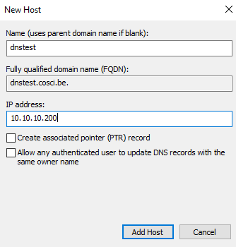

# Domain Name System

Active Directory kan niet zonder DNS. Want zonder DNS kunnen andere devices het domein niet vinden op het netwerk.

## 1. Even herhalen

### 1.1. DNS-client & DNS-server

DNS of Domain Name System is een service die een naam zoals `dns.google.com` kan omzetten naar een IPv4-adres als `8.8.8.8`, dit wordt ook wel name resolution (naamomzetting) genoemd.

Om dit eens in actie te zien, ping naar `dns.google.com` en `www.google.com` met het commando `ping <hostname> -4` waarbij het -4 parameter staat voor het gebruiken van IPv4. Controleer of deze IP adressen overeenkomen door dit rechtstreeks op te vragen aan een nameserver. Dit kan je doen in Powershell met `nslookup <hostname>`.

Met dit voorbeeld krijgen we dus een volledig overzicht te zien van wat een DNS hoort te doen. Onze DNS-client wilt `google.com` vinden. Google heeft hiervoor **records** opgeslagen in een tabel van een DNS-database. Deze records bevatten de koppeling tussen de naam en een IPv4-adres. Een server waarop deze records worden opgeslagen noemt men een **DNS-server**, in het geval van Google is dat `dns.google.com`. Een **DNS-client**, zoals deze geïnstalleerd op elke Windows PC, wordt ook wel een resolver genoemd. Deze DNS-client kan een record raadplegen op de DNS-server met een lookup. Vandaar het commando `nslookup` oftewel `name server lookup`.

Ook als je in de browser surft naar een adres als `www.facebook.com`, zal jouw DNS-client het IPv4-adres hiervan ophalen om dan te kunnen verbinden met de webserver van facebook.

### 1.2. DNS werking

Wanneer jouw DNS-client een record als `www.google.com` zoekt, zal deze eerst naar de DNS-server gaan die ingesteld is op jouw Windows PC. Deze wordt in de meeste gevallen automatisch ingesteld door je internet provider. Hoe je deze kan bekijken of aanpassen kan je snel online vinden. Als er bijvoorbeeld `8.8.8.8` is ingesteld, het DNS-server van `dns.google.com`, dan zal deze DNS-server meteen het record moeten kunnen teruggeven aangezien dit van google zelf is.

Als dit een andere DNS-server is, die het record niet heeft, dan zal deze DNS-server je moeten doorverwijzen naar andere nameservers die dat wel kunnen weten, bijvoorbeeld de root name servers zijn een goede verwijzing. Voor deze reden hebben DNS-servers ns-records die gericht zijn naar andere DNS-servers. In een ns-record heb je dan een adres met daarbij over welk bepaald domain het gaat. Op deze manier zou je helemaal tot bij de root servers kunnen terechtkomen en deze zal dan de weg wijzen naar `com.` en die zal dan op zijn beurt de weg weten naar `dns.google.com`. Op deze manier heb je uiteindelijk opnieuw je record.

Indien er geen DNS-servers zijn die weet hebben van dit record en er zijn ook geen doorverwijzingen meer naar nameservers die naar een hoger domain level zouden gaan, dan krijg je geen IPv4-adres en kan je dus ook geen verbinding maken.

DNS werkt met zowel TCP als UDP. DNS gaat hier voornamelijk de keuze maken tussen beide door ervan uit te gaan dat informatie dat groter is dan 512 bytes niet goed is voor UDP, en hiervoor dus TCP zal gebruiken. In realiteit wilt dit zeggen dat UDP wordt gebruikt voor queries tenzij er te veel informatie is, dan wordt er over geschakeld naar TCP. DNS zone transfers daarentegen bevatten altijd veel informatie en zullen altijd verstuurd worden met TCP.

Met wat wij hier doen met het `cosci.be` domein, zijn er geen records opgeslagen vanuit de rootserver `be` naar onze nameserver. Vandaar dat je vanuit een ander netwerk het domain `cosci.be` niet zal kunnen vinden. De Windows PC op hetzelfde netwerk in ons labo kan dit wel vinden, omdat wij de domain controller als DNS-server hebben ingesteld op de Windows PC.

> Je domain op het internet bereikbaar maken is ook niet de bedoeling van deze labo's, maar indien je je toch afvraagt hoe je ervoor zorgt dat jou domain wel zichtbaar is op het internet, dan zal je je domain moeten registreren op een rootserver. Dit kan je doen door naar domain name providers te gaan zoals `Domain.com`, `Namecheap` of `Bluehost` waarop je een domain kan kopen en configureren.

### 1.3. DNS adres

Een DNS naam wordt opgebouwd uit meerdere niveaus van domains, elk niveau onderverdeeld doormiddel van een punt ertussen. Een naam als `www.google.com.` moet je eigenlijk lezen van rechts naar links. Waarbij `com` de top level domain is, `google` het domain van google zelf en `www` een subdomain van google. Voor `www` zou je dus ook nog meerdere subdomains kunnen plaatsen bijvoorbeeld `www1.www.google.com.`.

Merk ook op dat na `com` ook nog een punt staat, dit is geen typefout! Dit is de manier hoe namen worden geschreven met DNS. Als je eens domeinnamen moet configureren op een DNS-server, dan zal je ook telkens in deze configuratie een naam moeten eindigen met een punt.

### 1.4. DNS zone transfer

DNS zone transfer is het mechanisme waarbij DNS databases zich repliceren over een set van DNS servers. Neem bijvoorbeeld onze COSCIDC1 en COSCIDC2 servers die beide hetzelfde domein voorstellen en dus 1 DNS database moeten delen en repliceren.

Dit mechanisme functioneert gelijkaardig aan een `master and slave` model. Waarbij de client als slave (COSCIDC2) een request stuurt naar de server als master (COSCIDC1). Er kan maar 1 master zijn en meerdere slaves.

De client gaat als eerste het SOA record ophalen. Dit is een record waarin een serial number kan gevonden worden dat werkt als een versiebeheer nummer. Wanneer dit nummer niet overeenkomt met het lokale nummer, dan wilt dit zeggen dat er een update is gemaakt. Indien er een update is zal de client een TCP request sturen, en antwoord de server met alle informatie over het domein. De client update dan zijn tabellen en het proces is rond.

Daarom is het dus ook belangrijk dat bij elke update aan DNS het serial nummer in het SOA record ook wordt aangepast. Vele services doen dit automatisch, maar in unix gebeurt dit bijvoorbeeld niet altijd.

## 2. Windows Server DNS

Er is reeds, samen met Active Directory Domain Services, een Domain Name System geïnstalleerd aangezien ADDS deze nodig heeft om te functioneren. Moest je server geen DNS hebben, dan was het niet mogelijk voor andere machines om het domein cosci.be te vinden. Want zonder DNS, kon ADDS nooit het cosci.be domein kunnen beschreven hebben als een IP-adres in een A record.

Om dit te zien kunnen gaan we eens kijken wat ADDS heeft opgezet. Je kan op je COSCIDC1 server de DNS manager openen onder `Tools > DNS` of `DNS > COSCIDC1 > DNS Manager`.

Als we dan COSCIDC1.cosci.be openklappen krijgen we enkele folders te zien waaronder `Forward Lookup Zones` en `Reverse Lookup Zones`, later in het lab hier meer over. Klap `Forward Lookup Zones` open en dan zie je `_msdcs.cosci.be` en `cosci.be`. De eerste is bedoeld om services te configureren, zoals onze 2 domain controllers al geconfigureerd staan met hun guid als alias. De tweede is de zone voor het domein cosci.be. Deze werden apart gezet zodat service records niet de normale gang van DNS op het internet zouden verstoren, aangezien deze services voornamelijk voor Windows zijn.

### 2.1. Windows DNS properties

In het domein cosci.be zie je 3 soorten records. SOA record die deze DNS table beschrijft. NS records die laten weten welke name servers er zijn, in dit geval staat er de DNS van COSCIDC1 en COSCIDC2. Tenslotte heel wat A records waarin onder andere de IP adressen van de machines in het domein worden beschreven.

Rechtermuisklik op cosci.be en open dan Properties. Hier kan je onder `Start of Authority (SOA)` de eigenschappen van het SOA record vinden:

* `Serial number` is dus waarmee je een zone transfer kan starten. Je ziet dat je deze enkel incrementeel omhoog kan, dat is ook zo omdat in de meeste systemen het hoogste serial nummer wint.
* `Refresh interval` is het interval waarna een slave DNS server een zone transfer gaat proberen.
* `Retry interval` is het interval waarna een slave DNS server opnieuw een zone transfer zal proberen indien dit mislukt was.
* `Expires after` is de tijd hoe lang een slave DNS server een kopij zal bijhouden indien er langdurig geen connectie kan gemaakt worden met de master DNS server.
* `TTL` is de tijd dat DNS records afkomstig van deze DNS gecached kunnen worden.
* `TTL for this record` is de tijd die bepaalt hoe lang dit SOA record blijft bestaan voordat het vernieuwd wordt.

Verder onder `Name Servers` kan je de COSCIDC1 en COSCIDC2 vinden. Hiervoor zijn 2 records elk aangemaakt. Een NS server elk om aan te duiden dat het elk een name server is en dit op basis van hun naam. Een A record elk om van deze naam een IP te kunnen uitmaken.

Onder de tab `General` kan je DNS pauzeren en replicatie aanpassen, pas de replicatie aan naar `To all domain controllers in this domain (for Windows 2000 compatiblity). Ga nu kijken op je COSCIDC2 onder DNS Manager, en kijk na of deze setting ook is aangepast.

> Dit kan even duren, met COSCIDC2 te herstarten kan dit sneller verlopen.

Pas op, deze setting is niet aangepast met een zone transfer, want er is hier geen DNS record voor. Maar wel met Active Directory replicatie.

### 2.2. DNS records

Zoals je kan zien, kan je op een DNS-Server allerlei soorten DNS records configureren. Hieronder een korte lijst van enkele veel voorkomende types van records:

* `SOA` Start-Of-Authority, met instellingen voor het (sub)domein, zoals TTL (Time-To-Live), serienummer, primaire server, responsible person. Hiermee configureer je de eigenschappen van de nameserver.
* `A` voor het bepalen van het IPv4-adres bij een naam en AAAA voor het bepalen van het IPv6-adres bij een naam.
* `CNAME` Canonical name voor het configureren van alias van een A of AAAA record.
* `PTR` voor het bepalen van een naam bij een IPv4- of IPv6-adres.
* `MX` voor het bepalen van de mailservers voor een domein, waarbij elke mailserver een eigen prioriteit toegewezen krijgt.
* `NS` voor het aangeven welke nameservers de authoritative nameservers zijn.
* `TXT` aanvankelijk gebruikt voor ieder door de gebruiker gewenst commentaar. Nu mede in gebruik door het SPF anti-spam initiatief.
* `SRV` een relatief nieuw record dat gebruikt wordt om services aan te duiden. Zoek eens onder `_tcp`. Daarin kan je SRV records vinden voor onze ldap services.

Hieronder een voorbeeld van `plesk.com` hoe de configuratie van een domein er zou kunnen uitzien met gebruik van een domain name provider.

Stel nu, je hebt een debian webserver draaien op het netwerk, en we willen deze bereikbaar maken in DNS met de naam `dnstest.cosci.be.`. We kunnen deze server niet registreren als een Windows machine op onze domain controller, dus maken we deze rechtstreeks aan in DNS. Maak in je primaire DNS server een nieuwe record van type A aan. Geef deze de naam `dnstest` en `10.10.10.200` als IP adres. Een PTR record is een record dat we gebruiken voor reverse DNS, laat deze optie voorlopig uit. De optie dat andere users deze record kunnen aanpassen laten we ook uit.

Maak nu ook een CNAME record aan die een alias `dnstestalias` voorstelt voor de naam `dnstest.cosci.be.`. Je kan hiervoor met de Browse functie werken, vergeet de punt niet te zetten.

### 2.3. Active Directory Integrated Zone

Als je cosci.be nu eens refreshed dan ga je zien dat Windows nu automatisch de serial aangepast heeft. Nu is het 15 minuten wachten totdat COSCIDC2 een zone transfer start om deze aanpassingen op te nemen, of toch niet ...

Als je naar de SOA records kijkt op elke domain controller. Dan heeft elke domain controller een eigen DNS server, dus COSCIDC2 kan geen zone transfers gebruiken om DNS te repliceren. Maar gelukkig doet Active Directory dit eigenlijk op een heel andere manier. De DNS van COSCIDC1 en COSCIDC2 zijn namelijk `AD-integrated zones`. Dit wilt zeggen dat deze DNS zones worden gerepliceerd met behulp van het AD replicatie proces. Herstart COSCIDC2 en dan zal je zien dat DNS is aangepast.

> Zone transfers komen dus niet aan bod tussen domain controllers. Maar je kan zone transfers wel gebruiken voor secondary DNS servers die geen domain controller zijn. Hiervoor moet je eerst zone transfers aanzetten in DNS Manager > cosci.be > properties > Zone Transfers, want deze staan uitgeschakeld bij installatie.

### 2.4. Windows Forward DNS

Wat we nu hebben aangemaakt zijn 2 records van type A en CNAME. Hiermee kunnen we forward DNS queries mee uitvoeren. Forward wilt zeggen dat we aan de DNS server kunnen vragen voor een IP adres voor een gegeven naam.

Op je Windows 10 machine, voer een query uit om het IP adres op te halen voor dnstest en dnstesalias met behulp van nslookup, bv. `nslookup dnstest`.

### 2.5. Windows Reverse DNS

Nu is het ook mogelijk om het omgekeerde te doen, namelijk reverse DNS. Hierbij wilt men zeggen dat we een naam kunnen opzoeken voor een gegeven IP adres.

Om dit op te zetten moeten we beginnen met een Reverse Lookup Zone aan te maken.

* Maak een nieuwe zone aan op COSCIDC1 onder Reverse Lookup Zones.
* Vervolgens moet je een zone type kiezen. De zone types zijn dus hetgeen dat het verschil maakt tussen een master en slave DNS, waarbij primary master is en secondary slave. Een stub zone is een zone die enkel cached en doorgeeft. Kies dus een primary zone.
* De optie `Store the zone in Active Directory` zorgt ervoor dat deze zone een AD-integrated zone wordt. Voor de hand liggend, laat deze optie aan staan.
* Dan kiezen we weer opnieuw op te repliceren naar alle domain controllers in dit domein.
* Selecteer IPv4 Reverse Lookup Zone.
* Hierna moet je je zone van een naam voorzien. Vul in het network ID wat door je subnetmask is opgenomen van je subneterk. `10.10.10.0 /24` -> `10.10.10.`. Vanonder zie je dan `10.10.10.in-addr.arpa` staan. Hou Network ID aangevinkt.
* Dan moete je kiezen op welk AD niveau er aanpassingen mogen gemaakt worden. Neem de optie dat aangeraden is voor Active Directory.
* Finish

Om dnstest nu te kunnen vinden met reverse DNS moeten we een PTR record aanmaken. Active Directory kan dit automatisch voor ons doen. Open de properties van het A record dnstest. Vink `Update associated pointer (PTR) record` aan > Apply > Ok. Kijk na dat er nu een PTR record is bijgekomen onder de reverse lookup zone, indien nodig moet je refreshen.

Op je Windows 10 machine, voer een query uit om de naam op te halen voor het IP adres `10.10.10.200` met behulp van nslookup, bv. `nslookup 10.10.10.200`.

## 3. Wat moet je na dit labo kennen/kunnen

* Je weet wat de verantwoordelijkheden zijn van een DNS server en DNS client.
* Je kan de werking van DNS uitleggen in eigen woorden.
* Je weet hoe dat DNS namen worden opgemaakt en kan deze zelf maken.
* Je weet wat DNS zone transfer is en hoe je deze opzet in Windows.
* Je kan DNS record types in eigen woorden uitleggen.
* Je kan de eigenschappen van een SOA record uitleggen.
* Je kan een A record, CNAME record en PTR record aanmaken.
* Je kan een active directory integrated reverse lookup zone aanmaken.
* Je kan forward en reverse lookup doen met nslookup.
