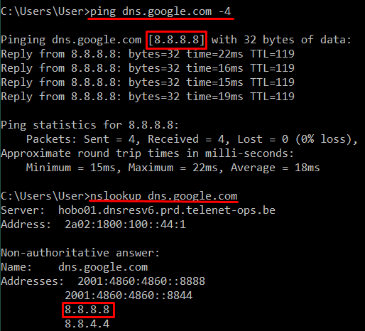
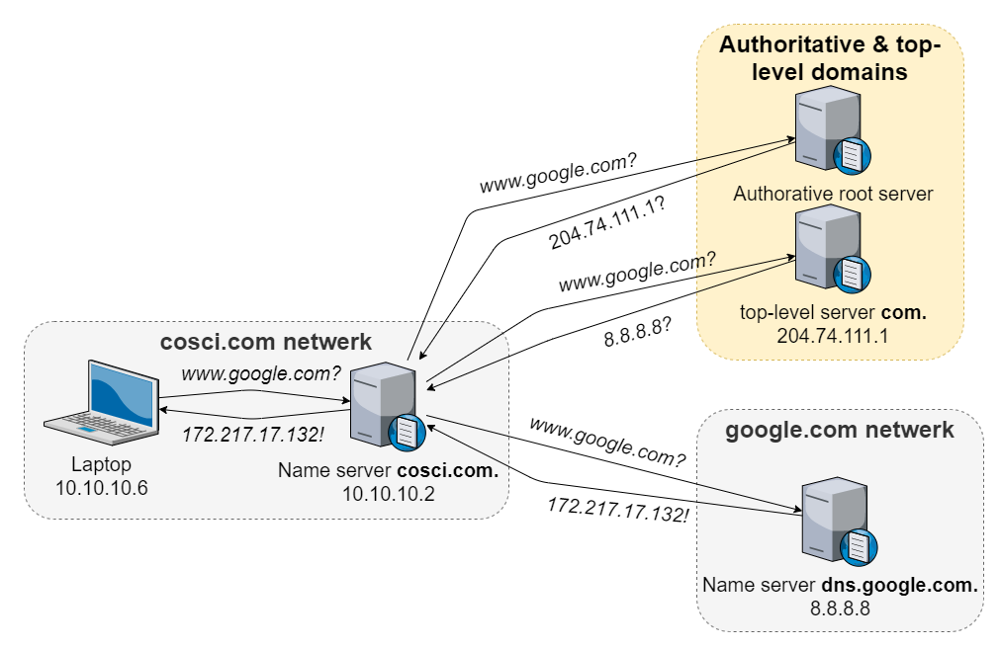
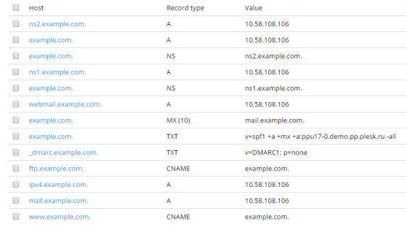

# DNS

Active Directory kan niet zonder DNS. Want zonder DNS kunnen andere devices het domain niet vinden op het netwerk.

## Even herhalen

### DNS-client & DNS-server

DNS of Domain Name System is een service die een naam zoals `dns.google.com` kan omzetten naar een IPv4-adres als `8.8.8.8`, dit wordt ook wel name resolution (naamomzetting) genoemd.

Om dit eens in actie te zien, ping naar `dns.google.com` en `www.google.com` met het commando `ping <hostname> -4` waarbij het -4 parameter staat voor het gebruiken van IPv4. Controleer of deze IP adressen overeenkomen door dit rechtstreeks op te vragen aan een nameserver. Dit kan je doen in Powershell met `nslookup <hostname>`.

Met dit voorbeeld krijgen we dus een volledig overzicht te zien van wat een DNS hoort te doen. Onze DNS-client wilt `google.com` vinden. Google heeft hiervoor **records** opgeslagen in een tabel van een DNS-database. Deze records bevatten de koppeling tussen de naam en een IPv4-adres. Een server waarop deze records worden opgeslagen noemt men een **DNS-server**, in het geval van Google is dat `dns.google.com`. Een **DNS-client**, zoals deze geinstalleerd op elke Windows PC, wordt ook wel een resolver genoemd. Deze DNS-client kan een record raadplegen op de DNS-server met een lookup. Vandaar het commando `nslookup` oftewel `name server lookup`.

Ook als je in de browser surft naar een adres als `www.facebook.com`, zal jouw DNS-client het IPv4-adres hiervan ophalen om dan te kunnen verbinden met de webserver van facebook.

### DNS werking

Wanneer jouw DNS-client een record als `www.google.com` zoekt, zal deze eerst naar de DNS-server gaan die ingesteld is op jouw Windows PC. Deze wordt in de meeste gevallen automatisch ingesteld door je internet provider. Hoe je deze kan bekijken of aanpassen kan je snel online vinden. Als er bijvoorbeeld `8.8.8.8` is ingesteld, het DNS-server van `dns.google.com`, dan zal deze DNS-server meteen het record moeten kunnen teruggeven aangezien dit van google zelf is.

Als dit een andere DNS-server is, die het record niet heeft, dan zal deze DNS-server je moeten doorverwijzen naar andere nameservers die dat wel kunnen weten, bijvoorbeld de root name servers zijn een goede verwijzing. Voor deze reden hebben DNS-servers ns-records die gericht zijn naar andere DNS-servers. In een ns-record heb je dan een adres met daarbij over welk bepaald domain het gaat. Op deze manier zou je helemaal tot bij de root servers kunnen terechtkomen en deze zal dan de weg wijzen naar `com.` en die zal dan op zijn beurt de weg weten naar `dns.google.com`. Op deze manier heb je uiteindelijk opnieuw je record.

Indien er geen DNS-servers zijn die weet hebben van dit record en er zijn ook geen doorverwijzingen meer naar nameservers die naar een hoger domain level zouden gaan, dan krijg je geen IPv4-adres en kan je dus ook geen verbinding maken.

Wat wij hier doen met het `cosci.be` domeinn, worden er geen records opgeslagen vanuit de rootserver `be` naar onze nameserver. Vandaar dat je vanuit een ander netwerk het domain `cosci.be` niet zal kunnen vinden. De Windows PC op hetzelfde netwerk in ons labo kan dit wel vinden, omdat wij de domain controller als DNS-server hebben ingesteld op de Windows PC.

> Je domain op het internet bereikbaar maken is ook niet de bedoeling van deze labo's, maar indien je je toch afvraagd hoe je ervoor zorgt dat jou domain wel zichtbaar is op het internet, dan zal je je domain moeten registreren op een rootserver. Dit kan je doen door naar domain name providers te gaan zoals `Domain.com`, `Namecheap` of `Bluehost` waarop je een domain kan kopen en configureren.

### DNS adres

Een DNS naam wordt opgebouwd uit meerdere niveau's van domains, elk niveau onderverdeeld doormiddel van een punt ertussen. Een naam als `www.google.com.` moet je eigenlijk lezen van rechts naar links. Waarbij `com` de top level domain is, `google` het domain van google zelf en `www` een subdomain van google. Voor `www` zou je dus ook nog meerdere subdomains kunnen plaatsen bijvoorbeeld `www1.www.google.com`.

Merk ook op dat na `com` ook nog een punt staat, dit is geen typefout. Dit is de manier hoe namen worden geschreven met DNS. Als je eens domainnamen moet configureren op een DNS-server, dan zal je ook telkens in deze configuratie een naam moeten eindigen met een punt.

### DNS records

Op een DNS-Server kan je dus allerlei soorten DNS records configureren. Hieronder is een lijst van enkele veel voorkomende types van records:

* SOA Start-Of-Authority, met instellingen voor het (sub)domein, zoals TTL (Time-To-Live), serienummer, primaire server, responsible person. Hiermee configureer je de eigenschappen van de nameserver.
* A voor het bepalen van het IPv4-adres bij een naam en AAAA voor het bepalen van het IPv6-adres bij een naam.
* CNAME Canonical name voor het configureren van alias van een A of AAAA record.
* PTR voor het bepalen van een naam bij een IPv4- of IPv6-adres.
* MX voor het bepalen van de mailservers voor een domein, waarbij elke mailserver een eigen prioriteit toegewezen krijgt.
* NS voor het aangeven welke nameservers de authoritative nameservers zijn. (ook gebruikt voor het verwijzen naar andere nameservers)
* TXT aanvankelijk gebruikt voor ieder door de gebruiker gewenst commentaar. Nu mede in gebruik door het SPF anti-spam initiatief.
* SRV een relatief nieuw record dat gebruikt wordt om services aan te duiden.

Hieronder een voorbeeld van `plesk.com` hoe de configuratie van een domein er zou kunnen uitzien met gebruik van een domain name provider.

### Windows Forward DNS

A Records - TODO

### Windows Reverse DNS

PTR Records - TODO