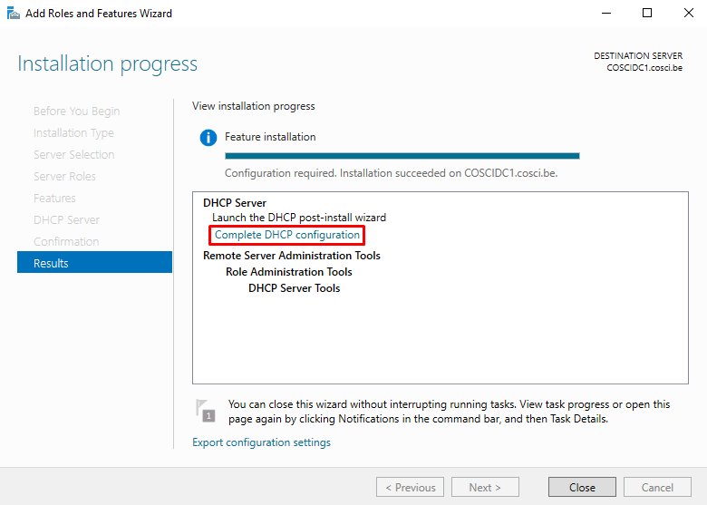
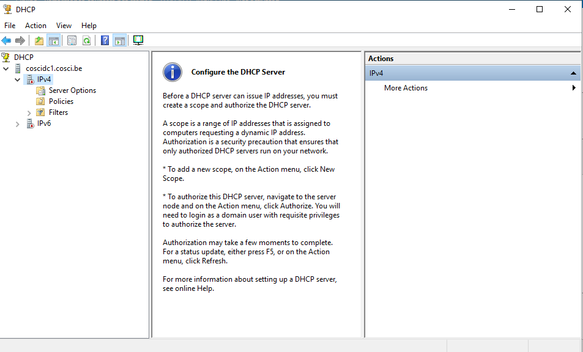
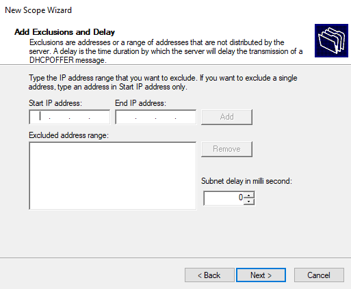
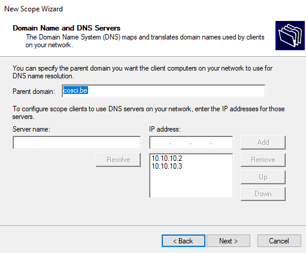
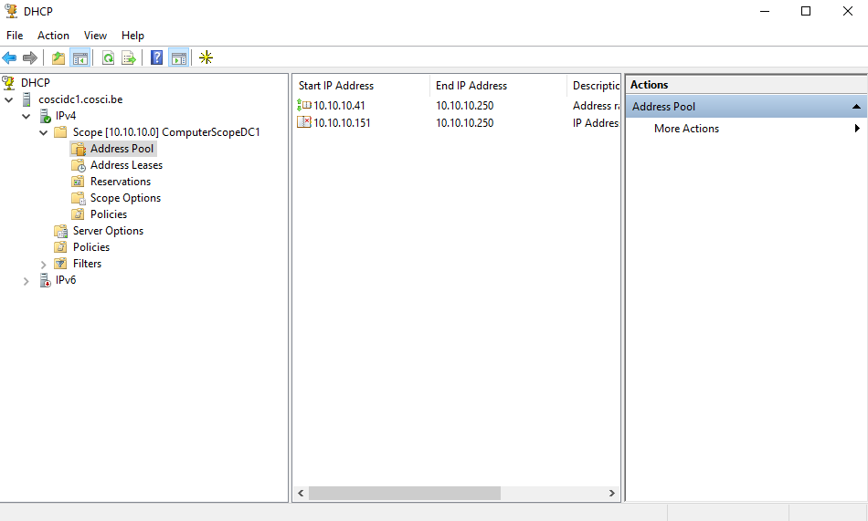

# Dynamic Host Configuration Protocol

In tegenstelling tot DNS is DHCP niet noodzakelijk voor het functioneren van Active Directory. DHCP kan evengoed geleverd worden door een DHCP server die niet deel is van het domein maar wel van hetzelfde netwerk. Toch is het handig om deze services op één plaats te hebben en kunnen we eveneens ook fouttolerante DHCP opzetten aangezien we 2 servers hebben.

## 1. IPv4 adressen

Om een machine met een netwerkkaart op een netwerk te kunnen laten communiceren heeft deze een IP-adres nodig. Deze IP-adressen kunnen op 2 manieren toegekend worden:

* Statisch
* Dynamisch

> Voor dit lab zullen we enkel gebruik maken van IPv4-adressering.

### 1.1. Statische IPv4-adressen

Statische adressen zijn we in vorige labs al een paar keer tegen gekomen. Zo hebben we COSCIDC1 en COSCIDC2 elk een statisch IPv4-adres gegeven. Om statische adressen op te zetten, moet je deze dus manueel opzetten op de machine zelf.

Je kan op deze manier kleinere netwerken opbouwen als je met minder dan 10 machines werkt, dan hoef je ook geen DHCP server op te zetten. Maar in het geval dat het er een honderdtal machines of meer zijn, zal dit eerder een lastig klusje worden. Je moet niet alleen op elke machine een IPv4-adres instellen, al deze IPv4-adressen moeten ook bijgehouden worden zodat 1 adres niet aan 2 machines wordt uitgegeven.

Nu, dit is geen opstelling van enkel statisch of dynamisch. In realiteit maken we zowel gebruik van statische adressering als dynamische adressering binnen een netwerk. Er zijn machines die je beter wel statisch adresseert zoals DHCP-servers, DNS-servers, webservers, mailservers, FTP-servers, file servers en nog meer. Want je zou deze servers willen configureren en terugvinden in DNS, denk aan DNS-records. In het geval van domein controllers wordt er zelfs een statisch adres verplicht.

### 1.2. Dynamische IPv4-adressen

Dynamische IPv4-adressen worden uitgedeeld door een server met een DHCP-functie, deze noemt men dan een DHCP-server. Het doel van deze server is om elke niet-statische geconfigureerde machine op het netwerk een uniek IPv4-adres te geven.

> Aangezien er altijd een beperkte voorraad aan IPv4-adressen zijn, kunnen deze toegekende adressen aan machines na verloop van tijd veranderen naar andere adressen. Dit is waarom je op je Windows 10 machine met het commando `ipconfig` niet altijd hetzelfde IP-adres had als daarvoor.

### 1.3. DHCP-servers op Routers

Bij de meesten van ons thuis, krijgen onze privé machines IP-adressen van een DHCP-server die op de modem of router staat geïnstalleerd. Dit is op dit moment ook het geval in VirtualBox, waarbij de host-only network router een DHCP-server is. Maar DHCP moet niet bepaald op een router staan op het netwerk om te functioneren.

Elk machine heeft voor elk apart netwerk, waarmee deze verbonden is, een apart netwerkkaart. Een router heeft 2 netwerkkaarten, één voor binnen het netwerk en één voor het internet. Een GSM heeft ook 2 netwerkkaarten, één voor WIFI en één voor datanetwerk.

Dit wil dus zeggen dat binnen een netwerk elke machine één netwerkkaart heeft en om al deze netwerkkaarten een adres te geven, moet enkel één machine de verantwoordelijkheid nemen. Vaak is dit de router, maar je kan deze verantwoordelijkheid ook aan een willekeurige machine geven op het netwerk. Zolang er maar 1 DHCP server werkt over een bepaald bereik van IP-adressen op het netwerk kan dit. Maar het mag dus niet mogelijk zijn dat 2 DHCP servers hetzelfde adres kunnen uitdelen anders loopt dit fout.

> Met een GSM kan je vaak enkel een WIFI hotspot aanzetten als je jouw WIFI uitschakelt. Dit is vanwege dat de WIFI hotspot jouw WIFI-netwerkkaart in gebruik neemt voor een eigen WIFI netwerk.

## 2. DHCP Werking

Een DHCP-server kent IP adressen toe aan DHCP-clients, maar dat gebeurt niet elke keer dat de client opstart. De client en server gaan de link tussen de client en een IP-adres onthouden en daarbij een bepaalde leaseduur. Naast de leaseduur worden er ook op de client nog enkele andere instellingen opgeslagen, zoals domain name, default gateway en DNS-servers die ook meegegeven werden door de server.

Wanneer een machine zich voor het eerst op een netwerk bevindt, dan zal de machine als DHCP-client het volgende DHCP proces starten.

* De client stuurt een (broadcast) verzoek uit om een IPv4-adres te krijgen op het netwerk, dit noemt men een `DHCP-discover`.
* Elke DHCP-server antwoordt op dat verzoek door een IPv4-adres met bijhorende leasetermijn aan te bieden, namelijk een `DHCP-offer`.
* De client accepteert het eerste aanbod en stuurt een bevestiging van ontvangst. Daarbij verzoekt (opnieuw met broadcast) de client om het IPv4-adres gedurende het volledige leasetermijn te gebruiken, m.a.w. een `DHCP-request`. Ook al is deze request in broadcast, dit bericht bevat het adres van de gekozen DHCP-server waardoor andere DHCP-servers niet zullen inspringen.
* Tenslotte stuurt de DHCP-server het IPv4-adres, leaseduur en andere TCP/IP instellingen met een `DHCP-ACK` (Acknowledgement).
* De client kan vanaf nu deze instellingen gebruiken en de server registreert de link.

### 2.1. DHCP Renewal

Indien de client al een IPv4-adres had en het leasetermijn is verlopen dan zal de client deze proberen te vernieuwen, door meteen met het `DHCP-request` in het hele proces te starten, dit noemt men `lease renewal`. Clients zullen gewoonlijk niet wachten tot de leasetermijn verlopen is en vernieuwen deze tijdelijk, bijvoorbeeld bij elke keer dat de machine opstart.

Als de client zijn lease niet kan vernieuwen, omdat het adres niet meer gelinkt is op de server of geleased is aan een andere client, dan zal de server op het `DHCP-request` antwoorden met een `DHCP-NAK` (Negative Acknowledgement). In dit geval moet de client het hele DHCP proces herstarten met een `DHCP-discover`.

> Je kan je DHCP instellingen bekijken met het commando `ipconfig /all`. Dit kan zowel in je Windows 10 VM als jouw eigen computer. Je kan ook commando's gebruiken om sommige functies op te roepen: `ipconfig /release` zal de link tussen jouw IPv4-adres en machine verwijderen. `ipconfig /renew` start het lease renewal proces. Probeer deze functies eens uit in je Windows 10 VM.

### 2.2. DHCP Transportlaag

DHCP werkt volledig bovenop UDP want DHCP werkt met allemaal kleine pakketjes die eenmalig over het netwerk worden verstuurd. Er is dus geen nood aan een onderhouden connectie die TCP kan leveren. Bovenal, DHCP werkt met broadcasting en broadcasting is niet mogelijk met TCP. Want TCP is een protocol dat alleen werkt tussen 2 bepaalde machine's.

## 3. DHCP in Active Directory

We gaan nu een DHCP installeren op COSCIDC1. Voordat we hieraan beginnen moet je de DHCP server uitzetten van het host-only netwerk van VirtualBox. Je kan deze uitzetten onder `File > Host Network Manager ...`

> Net zoals in een vorig lab worden deze DCHP server aanpassingen in VirtualBox niet meteen doorgevoerd. Je zal dus terug in Taakbeheer alle `VirtualBox DHCP Server` processen moeten uitschakelen. Desnoods kan je jouw PC herstarten.

### 3.1 DHCP Installatie

Het installeren van DHCP komt neer op het installeren van de server role DHCP Server en die vervolgens te configureren.

* Start COSCIDC1 op
* Log in met domein admin account
* Onder `Manage` klik `Add Roles and Features`
* Role-based or feature-based installation
* Selecteer COSCIDC1 server
* Selecteer DHCP Server
* Stap verder doorheen de wizard en instal (LET OP: sluit na installatie het venster niet)
* In het installatie venster, klik op de link `Complete DHCP configuration` onder DHCP Server

* Onder Authorization selecteer `Skip AD authorization` en Commit
* Sluit alle vensters en herstart de server

### 3.2. DHCP Configuratie

Open nu het DHCP configuratie venster, deze kan je vinden onder `DHCP > DHCP Manager` of `Tools > DHCP`. Selecteer IPv4, je scherm zou er nu als volgt moeten uitzien:

Op het info scherm lees je dat je een scope moet aanmaken en de server alsnog moet autoriseren.

#### 3.2.1. DHCP Scope

Een DHCP scope is een bereik van IP adressen, deze worden gedefinieerd door een inclusief start-adres en inclusief eind-adres. Binnenin een scope kunnen we dan nog blokken definiëren die de scope niet mag gebruiken. Een DHCP server is dan uiteindelijk opgebouwd uit één of meerdere van deze scopes.

Voordat we deze configureren moeten we eerst eens nadenken over welke scopes we willen definiëren. We moeten het bereik van ons subnetwerk opdelen in stukjes. Op deze manier kunnen we een stukje geven aan servers, printers, computers en reserve.

Deel nu je subnetwerk op, hieronder een voorbeeld van het subnetwerk 10.10.10.0 /24.

* Domain Controllers: 10.10.10.1 - 10.10.10.10
* (Web, FTP, ...) Servers: 10.10.10.11 - 10.10.10.30
* Printers: 10.10.10.31 - 10.10.10.40
* Computers: 10.10.10.41 - 10.10.10.250
* Reserve: 10.10.10.251 - 10.10.10.254

Nadat je deze opstelling hebt gemaakt, kunnen we deze scopes nu configureren. Aangezien deze opstelling allemaal statische delen bevat behalve het deeltje voor computers, gaan we uiteindelijk enkel een scope moeten aanmaken voor computers.

Onder IPv4 maak de scope aan voor computers:

* Ga van start met `New Scope`
* Geef een naam in zoals `ComputerScopeDC1`
* Het start en eind adres zoals je deze opgelijst had (10.10.10.41 - 10.10.10.250)
* Vul het subnet mask in doormiddel van length (/24) of de mask zelf (255.255.255.0)
* Vervolgens komen we aan het exclusions gedeelte, hiermee stappen we meteen verder in het volgende hoofdstuk want dit heeft nu al te maken met fouttolerantie

#### 3.2.2. DHCP Fouttolerantie

We willen hierbij even stilstaan omdat we exclusions moeten maken i.v.m. fouttolerantie. De twee DHCP servers die we installeren zullen bij installatie ook 2 echte DHCP servers zijn en active directory gaat hier verder niets mee doen. Het is aan ons om de mogelijke problemen op te lossen wanneer we 2 DHCP servers opzetten op 1 netwerk. Het gevaar met meerdere DHCP servers op te zetten is dat 2 DHCP servers éénzelfde IP-adres kunnen uitdelen aan 2 verschillende machines. De oplossing hiervoor is echter simpel, voorkom dat éénzelfde adres kan uitgedeeld worden met behulp van scopes en exclusies.

We configureren best op beide DHCP servers dezelfde scopes, maar we kunnen dan exclusies maken van welk deel van de scope elke DHCP server mag uitdelen. Door de configuratie van een exclusie zal de DHCP server deze adressen niet uitdelen en kan de andere DHCP server dat in die plaats wel doen.

Ik ga mijn scope opdelen in ongeveer 2 gelijke delen: 10.10.10.41 - 10.10.10.150 en 10.10.10.151 - 10.10.10.250. Het eerste deel wil ik gebruiken voor COSCIDC1 dus het tweede deel zal ik een exclusie van moeten maken.

* Voeg de exclusie toe met inclusief begin-adres en inclusief eind-adres (10.10.10.151 - 10.10.10.250)
* Stel het leaseduur in op 7 dagen
* DHCP options om TCP/IP instellingen te beheren willen we configureren, `Yes, I want to configure these options now`
* Het host-only network van VirtualBox voorziet ons van een router. Het adres van deze router heb je ingesteld in VirtualBox, gebruik deze als default gateway (10.10.10.1)
* In het volgende venster staat het domein al juist. Maar de DNS servers nog niet. Maak eerst deze lijst leeg. Start COSCIDC2 op, wanneer deze opgestart is voeg de IP-adressen toe van zowel COSIDC1 als COSCIDC2 (10.10.10.2, 10.10.10.3). De wizard gaat proberen een connectie te maken, als er geen waarschuwing komt is deze gelukt en dan ben je zeker dat dit de juiste adressen zijn. Indien niet moet je de status van je servers en hun adressen nakijken.

* Het volgende is WINS, dit is een verouderd systeem van Windows, dat actief was rond de tijd van Windows 95, die hetzelfde doel had als DHCP maar met een andere werkwijze. WINS zorgt voor de omzetting van een machine's NetBIOS-name naar een IPv4-adres. Dit hebben we niet nodig dus laat deze zoals het is. Weet gewoon dat dit bestaat en dat sommige oudere systemen hierop zouden kunnen werken.
* Activeer de scope nog <ins>niet</ins>. We willen nog de eigenschappen bekijken en we moeten ook nog autoriseren.
* Finish

Voor nu dezelfde stappen uit om DHCP Server te installeren op COSCIDC2, het enige verschil is de exclusie onder je DHCP scope en de naam van deze scope is dan `ComputerScopeDC2`.

### 3.3. DHCP Eigenschappen

Voordat we DHCP activeren, kunnen we eens zonder zorgen rondkijken naar wat de DHCP Manager allemaal te bieden heeft.

In je DHCP Manager:

* Rechtermuisklik op je server (coscidc1.cosci.be) > properties, hier zie je waar alles van je DHCP server wordt opgeslagen. Er worden automatisch backups gemaakt en deze kan je dus hier ook vinden.
* Vouw je scope open en je ziet 5 folders:
  * Address Pool: hier ze je jouw geconfigureerde bereiken, inclusief en exclusief
  * Address Leases: hier zie ja alle adressen die door deze scope momenteel zijn uitgeleend, momenteel zal deze leeg blijven
  * Reservations: hier kan je specifieke adressen reserveren aan machines op basis van het MAC-adres. Open eens New Reservation en dan kan je zien wat hiervoor nodig is. Annuleer deze actie.
  * Scope Options: hier zie je allerlei opties die we al geconfigureerd hebben bij het aanmaken van de scope. Deze opties worden meegegeven aan de client voor TCP/IP instellingen. Er zijn echter nog veel meer opties, deze kan je eens bekijken onder Configure Options.
  * Policies: bij deze kan je policies aanmaken waarmee je DHCP settings kan instellen op basis van eigenschappen als een MAC adres.
* Rechtermuisklik op je scope > properties:
  * Onder General zie je nogmaals de instellingen die je geconfigureerd had.
  * Onder DNS kan je zien hoe DHCP en DNS samenwerken, wanneer een client een adres krijgt, zullen de A en PTR records hiervoor geupdate worden.

### 3.4. DHCP Autoriseren

Door een DHCP server te autoriseren neem je DHCP op in active directory. Vanaf dan zal de DHCP service geleverd worden aan computers van het domein. Windows Server 2019 voorkomt hiermee ook dat vreemde DHCP-servers van derden IP-adressen uitdeelt aan computers van het domein. Een niet-geautoriseerde DHCP server op Windows schakelt zichzelf uit.

Op COSCIDC1 in DHCP Manager, rechtermuisklik op je server (coscidc1.cosci.be) en dan Authorize. Deze knop wordt dan vervangen door Unauthorize indien je deze terug wilt uitzetten.

Nu dat je DHCP server geautoriseerd is, activeer de scope. Er zou dan een groene checkmark moeten komen bovenop je DHCP server.

Autoriseer en activeer nu ook op COSCIDC2.

### 3.5. DHCP Troubleshooting

Om snel DHCP te kunnen troubleshooten kan je gebruiken maken van de commando's `ping` en `ipconfig`.

Start je Windows 10 VM op en en ping naar `127.0.0.1`, indien dit mislukt zullen de TCP/IP waarschijnlijk fout staan. Kijk ook `ipconfig /all` na, hierin kan je alle settings vinden, verder kan je met `ipconfig` ook acties gebruiken als `release` en `renew` indien nodig.

Normaal heeft je machine nu een adres gekregen vanuit de scope. Kijk na of deze nu ook in de scope voorkomt onder leases. Deze kan uitgeleend zijn door één van de servers, kijk dus in beide.

### 3.6. DHCP Failover

We hebben tot nu toe fouttolerantie verbetert met behulp van exclusies in scopes, dit is hoe je het in normale DHCP servers zou doen. Maar het kan met Windows ook anders. Met de laatste versies van Windows Server kan je de scopes en settings van DHCP laten repliceren net zoals dat gedaan wordt met DNS. Hiervoor hebben we DHCP Failover nodig, deze staat niet aan bij installatie, maar om dit te voorzien moeten we deze enkel maar opzetten in DHCP Manager. We gaan ook een paar aanpassingen moeten doen omdat dit niet samewerkt met het originele idee van exclusies.

* Verwijder op COSCIDC1 de exclusie onder `Address Pool`
* Verwijder de hele scope op COSCIDC2
* Op COSCIDC1, rechtermuisklik op IPv4
  * Configure Failover ...
  * Select all
  * Add Server > selecteer COSCIDC2
  * Vul een secret in als `p@ssw0rd`, deze wordt gebruikt om communicatie tussen DHCP-servers te beveiligen
  * Finish

> Vanaf nu zullen COSCIDC1 en COSCIDC2 dezelfde scope hebben, elkaar up to date houden van leases en het werk verdelen. Kijk maar eens op beide servers onder Address Pool en Address Leases, refresh indien nodig, deze zouden nu synchroon moeten zijn. Zet COSCIDC1 uit, voer op je Windows 10 VM `ipconfig /release` dan `ipconfig /renew` uit en merk op dat COSCIDC2 een hoger adres teruggeeft dan COSCIDC1 vanwege de exclusie achter de schermen.

## 4. Wat moet je na dit labo kennen/kunnen

* Je weet het verschil tussen statische en dynamische IPv4-adressering.
* Je kent de werking van dynamische IPv4-adressering via DHCP.
* Je bergijpt waarop DHCP niet met TCP werkt.
* Je kan het hele proces van DHCP in eigen woorden uitleggen met proces benamingen.
* Je weet hoe je een DHCP server kan opzetten.
* Je weet hoe je de fouttolerantie van DHCP kan verbeteren.
* Je kan een DHCP server autoriseren in active directory.
* Je weet hoe je DHCP scopes kan opzetten.
* Je begrijpt de eigenschappen van een DHCP server.
* Je kan DHCP Failover opzetten.
* Je kan met het `ipconfig` commando werken.
