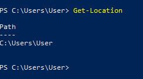

# PowerShell

Als systeem en netwerkbeheerder zou je niet meteen denken dat je veel moet kunnen programmeren, maar toch komt er bij beheren heel wat scripting kijken. Het is aan ons om ons werk te automatiseren en efficiënter te maken met scripting.

Er bestaan heel wat programmeertalen waarin we makkelijk kleine en eenvoudige scripts kunnen schrijven, zoals Python, Ruby of gewoon de veel voorkomende shell scripts als bash. Microsoft heeft ook een eigen shell script ontwikkeld, namelijk PowerShell. Met PowerShell kunnen we gebruik maken van shell commando's, .NET Framework functies en zelfs Active Directory commando's.

We gaan deze features en mogelijkheden opbouwend bekijken. In dit lab gaan we zien wat er mogelijk is met de command line en ook het maken van PowerShell scripts die we dan kunnen uitvoeren. In het volgend lab gaan we dan verder uitbreiden naar .NET features en Active Directory tools.

## 1. Installatie

### 1.1. Installatie PowerShell

Voor diegene met Windows is PowerShell al automatisch geïnstalleerd en hoef je verder niets te doen. Maar voor diegene die werken op Linux of MacOS, je kan PowerShell installeren op je PC of werken in een Windows VM. Voor dit lab raad ik echter aan om op de PC zelf te werken.

* [Install PowerShell on Linux](https://docs.microsoft.com/nl-nl/powershell/scripting/install/installing-powershell-core-on-linux?view=powershell-7.1)
* [Install PowerShell on MacOS](https://docs.microsoft.com/nl-nl/powershell/scripting/install/installing-powershell-core-on-macos?view=powershell-7.1)

### 1.2. Installatie Visual Studio Code

Visual Studio Code is een gratis lichte code editor waarmee we PowerShell scripts gaan schrijven. Deze is gratis te [downloaden](https://code.visualstudio.com/) en wanneer je deze hebt opgestart kan je alvast de [PowerShell Extentie](https://marketplace.visualstudio.com/items?itemName=ms-vscode.PowerShell) installeren.

<div class="page-break"></div>

## 2. Shell Commando's

Om te beginnen bij het begin, starten we met de basis van een shell. Even een korte introductie van shell commando's die je in PowerShell kan gebruiken die wellicht bekend zijn als je al met andere Unix systemen hebt gewerkt.

Eerst moet je een PowerShell window openen, dit kan je op 2 manieren doen net zoals een commandline:

1. Je kan deze rechtsonder met Windows > Windows PowerShell openen
2. In File Explorer > navigeer naar een folder > in de browserbar, waarin het pad naar deze folder staat, type `powershell` en druk dan enter

Volg nu de volgende stappen:

* Maak een folder `TestFolder` aan met het commando `mkdir`
* Navigeer naar deze folder met `cd`
* Kijk na of je wel degelijk in de folder zit met `pwd`
* Maak een file `test.txt` aan met `echo` met de output operator `>` => `echo test > test.txt`
* Bekijke de inhoud van deze file met `cat`
* Maak een kopie `copy.txt` van deze file met `cp`
* Maak een folder `SubFolder` aan met het commando `mkdir`
* Lijst alle files en folders op met `ls`
* Verplaats de kopie `copy.txt` naar de subfolder met `mv`
* Lijst alle subfolders recursief op met `tree`
* Gebruik het commando `rm` om `test.txt` te verwijderen
* Ga een folder terug met `cd`
* Gebruik de parameter `-r` met `rm` om de folder te verwijderen
* Gebruik `clear` om de command line op te ruimen

<div class="page-break"></div>

### 2.1. Aliassen

Zoals je kan zien zijn deze commando's ongeveer hetzelfde als andere Unix systemen en gedragen deze zich ook heel gelijkaardig. Maar deze zijn slechts aliassen voor cmdlets binnen PowerShell. Hoe kan je dat merken? Type eens `cat` zonder parameters en dan zal je een waarschuwing zien van de cmdlet `Get-Content` vanwege dat je een parameter ontbreekt.

Probeer de stappen hierboven nog eens uit, maar dan met de echte cmdlet achter de alias. Hieronder de mappings, heb je hetzelfde resultaat?

| Alias | Cmdlet |
| :---: | :---: |
| mkdir | `New-Item -ItemType Directory` |
| cd | `Set-Location` |
| pwd | `Get-Location` |
| echo | `Write-Output` |
| cat | `Get-Content` |
| cp | `Copy-Item` |
| ls | `Get-ChildItem` |
| mv | `Move-Item` |
| tree | `Get-ChildItem -Recurse -Directory` |
| rm | `Remove-Item` |
| rm -r | `Remove-Item -Recurse` |
| clear | `clear` |

<div class="page-break"></div>

### 2.2. Piping

Net zoals in Unix, kunnen we in PowerShell gebruik maken van pipes. Voor sommige van functies is het zelfs de bedoeling dat deze gepiped worden. Neem als voorbeeld het oplijsten van files en hiervan de eigenschappen te formatteren naar een tabel. We kunnen hier gebruik maken van Get-ChildItem en Format-Table met een `|` pipe operator tussenin.

```PowerShell
Get-ChildItem | Format-Table Name, Length
```

Om deze dan weg te schrijven naar een bestand of andere streams, hebben we de `>` redirectie operator.

```PowerShell
Get-ChildItem | Format-Table Name, Length > Table.txt
```

### 2.3. Environment Variables

Tenslotte hebben we in PowerShell ook toegang tot omgevings-variablen. Ja, dat zijn de environment variables dat je kan vinden onder `My Computer > Advanced System Settings > Environment Variables`. Je kan deze aanspreken met het formaat $env:<variable_name>.

```PowerShell
echo $env:HOMEPATH
echo $env:USERNAME
```

Hieronder een overzicht van wat je hier allemaal kan uithalen:

| Case-sensitive variable name | Typical value |
| :---: | :---: |
| ALLUSERSPROFILE | C:\ProgramData |
| APPDATA | C:\Users\sername\AppData\Roaming |
| CommonProgramFiles | C:\Program Files\Common Files |
| COMPUTERNAME | computername |
| ComSpec | C:\WINDOWS\system32\cmd.exe |
| HOMEDRIVE | C: |
| HOMEPATH | \Users\username |
| LOCALAPPDATA | C:\Users\username\AppData\Local |
| LOGONSERVER | (Varies) |
| NUMBER_OF_PROCESSORS | (Varies) |
| OS | Windows_NT |
| Path | C:\WINDOWS\system32; C:\WINDOWS; C:\WINDOWS\System32\Wbem; | C:\Windows\System32\WindowsPowerShell\v1.0 |
| PATHEXT | .COM;.EXE;.BAT;.CMD;.VBS;.VBE;.JS;.JSE;.WSF;.WSH;.MSC |
| PROCESSOR_ARCHITECTURE | (Varies) |
| PROCESSOR_IDENTIFIER | (Varies) |
| PROCESSOR_LEVEL | (Varies) |
| PROCESSOR_REVISION | (Varies) |
| ProgramData | C:\ProgramData |
| ProgramFiles | C:\Program Files |
| PUBLIC | C:\Users\Public |
| SESSIONNAME | (Varies) |
| SystemDrive | C: |
| SystemRoot | C:\WINDOWS |
| TEMP | C:\users\username\AppData\Local\Temp |
| TMP | C:\users\username\AppData\Local\Temp |
| USERPROFILE | C:\Users\username |

<div class="page-break"></div>

## 3. PowerShell Scripting

Zoals je hierboven al vernomen hebt, PowerShell werkt met cmdlets. Maar wat is een cmdlet? `Cmdlets` zijn functies gemaakt in een PowerShell omgeving. Deze functies werken op objecten zonder types, dat wil zeggen dat het PowerShell niet uitmaakt of je nu een getal, tekst of zelfs een heel File object meegeeft. PowerShell gaat proberen het beste ervan te maken met welk object je geeft, daarom dat we deze objecten `dynamische objecten` noemen.

> Deze dynamische objecten kon je eigenlijk al zien in de vorige oefening. Voer nog eens `Get-Location` uit, dan zie je dat het resultaat een object is met eigenschap `Path`. 

In Visual Studio Code, open een folder waarin je zal werken met PowerShell. Maak een file `MyFirstPowerShell.ps1` aan en voeg de volgende inhoud toe:

```PowerShell
Write-Output "Hello World!"
```

Onderaan in Visual Studio Code zou je een `Terminal` moeten hebben. Indien dat niet het geval is, moet je een nieuwe Terminal openen onder de opties links vanboven. In deze Terminal type je dan `.\MyFirstPowerShell.ps1`. Je hebt zojuist je eerst Hello World script gemaakt in PowerShell.

<div class="page-break"></div>

### 3.1. Functies

In scripting kunnen we ook functies maken, deze functies zijn dan cmdlets waaraan we dynamische objecten kunnen meegeven als parameter en uitvoeren om een dynamisch object als resultaat te krijgen.

Vervang de inhoud van `MyFirstPowerShell.ps1` met hetgeen hieronder en voer het script uit.

```PowerShell
function Write-HelloWorld {
    Write-Output "Hello World!"
}

Write-HelloWorld
```

We hebben hetzelfde resultaat als ervoor, maar wat hebben we juist gedaan? Door de syntax `function <cmdlet_name> { ... }` te gebruiken, hebben we een cmdlet aangemaakt die `Hello World!` print. Daarna, verder in het script, voeren we deze cmdlet uit door de naam van de functie te gebruiken.

#### 3.1.1. Parameters

Aan deze cmdlets kunnen we ook parameters toevoegen. Om aan je cmdlet een parameter toe te voegen moeten we er het volgende van maken.

```PowerShell
function Write-Text {
    param (
        $Text
    )
    Write-Output $Text
}

Write-Text -Text "Hello World!"
```

Je merkt dus dat we nog steeds dezelfde output hebben, maar we hebben nu wat meer flexibiliteit in wat we met onze cmdlet kunnen doen. Als we de volgorde van parameters bewaren, moeten we de parameters zelfs niet benoemen.

```Diff
-Write-Text -Text "Hello World!"
+Write-Text "Hello World!"
```

<div class="page-break"></div>

#### 3.1.2. Mandatory Parameters

De parameter van de cmdlet die je nu hebt, is niet verplicht om ingevuld te worden. Probeer eens je cmdlet uit te voeren zonder parameter:

```Diff
-Write-Text -Text "Hello World!"
+Write-Text
```

Zoals je kan zien is er als resultaat helemaal geen output, niet eens een nieuwe witte regel. We hebben hier gelukkig een oplossing voor, door de parameter verplicht te maken met een Mandatory Parameter attribuut:

```PowerShell
function Write-Text {
    param (
        [Parameter(Mandatory)]
        $Text
    )
    Write-Output $Text
}

Write-Text
```

Nu zal je cmdlet vragen voor een parameter indien je deze vergeet mee te geven.

<div class="page-break"></div>

### 3.2. Variablen

Variablen zijn case insensitief en gebruiken we om resultaten van bewerkingen in op te slagen. Zo kunnen we een extra tekst toevoegen aan de initiële input.

```PowerShell
function Write-Text {
    param (
        [Parameter(Mandatory)] $Text
    )

    $variable = $Text + " Also Hello!"

    Write-Output $variable
}

Write-Text "Hello World!"
```

Hou er rekening mee dat deze variablen alleen het resultaat bijhouden van wanneer deze variable is aangemaakt. Als je $Text zou aanpassen, past de variable dus niet mee aan.

```PowerShell
function Write-Text {
    param (
        [Parameter(Mandatory)] $Text
    )

    $variable = $Text + " Also Hello!"

    Write-Output $variable

    $Text = "Hmmm."
    
    Write-Output $variable
}

Write-Text "Hello World!"
```

<div class="page-break"></div>

### 3.3. Condities

Nu om wat logica toe te voegen, gaan we gebruik maken van conditionele operators. Stel nu we willen een tweet maken, dan willen we aan onze cmdlet een tekst meegeven om iets uit te schrijven, maar als de tekst langer is dan 255 characters, dan willen we in de plaats een error gooien dat de tekst te lang is.

Om condities op te maken, heeft PowerShell hier een aantal vergelijkingsmiddelen:

| Operator | Beschrijving |
| :---: | :---: |
| -eq | gelijk aan |
| -ne | niet gelijk aan |
| -lt | kleiner dan |
| -gt | groter dan |
| -le | kleiner dan of gelijk aan |
| -ge | groter dan of gelijk aan |
| -like | wildcard tekst vergelijking |
| -notlike | wildcard tekst vergelijking |

Met de operators hierboven hebben we dus de mogelijkheid om een conditie te maken waarbij $Text kleiner is dan 255 en het resultaat opslagen in een variable bv.

```PowerShell
$tweetFits = $Text.Length -le 255
```

<div class="page-break"></div>

#### 3.3.1. If Statement

Met een conditie kan je met behulp van een if statement de cmdlet iets laten uitvoeren indien de conditie waar is:

```PowerShell
function Write-Tweet {
    param (
        [Parameter(Mandatory)] $Text
    )

    $tweetFits = $Text.Length -le 255

    if ($tweetFits) {
        Write-Output $Text
    }
}

Write-Tweet "Hello World!"
```

Het resultaat van dit script is dus terug opnieuw "Hello World!", maar als je een veel langere tekst invult dan zou deze niets schrijven. Om dit te testen is het best om een stukje tekst te nemen en een aantal keer te copy-pasten na elkaar.

#### 3.3.2. Else Statement

Om een error te geven indien de conditie onwaar is hebben we else statements. Na een if stament is het mogelijk om een else statement te plaatsen om de onwaar conditie op te nemen.

```PowerShell
function Write-Tweet {
    param (
        [Parameter(Mandatory)] $Text
    )

    if ($Text.Length -le 255) {
        Write-Output $Text
    }

    else {
        Write-Error "Given text is too long for a tweet, maximum length is 255 characters."
    }
}

Write-Tweet "Hello World!"
```

<div class="page-break"></div>

#### 3.3.3. Elseif Statement

Elseif statement is de combinatie van een else if. Als je juist een if statement hebt gebruikt, kan je verdiepen door elseif te gebruiken. Na een elseif kan je nog meerdere elseif statements gebruiken en optioneel afsluiten met een else statement die voor alle voorgaande condities onwaar opneemt.

```PowerShell
    if ($text.length -eq 0) {
        # Empty Text
    }

    elseif ($Text.Length -le 255) {
        # Fits
    }

    elseif ($text.length -lt 1000000000) {
        # Waaaaaay to long
    }

    else {
        # Does not fit
    }
```

#### 3.3.4. Switch Statement

Als alternatief van if-else statements kunnen we dit allemaal ook beschrijven met een switch, waarbij we een variable als input geven om te vergelijken.

```PowerShell
function Write-Tweet {
    param ([Parameter(Mandatory)] $Text)
    switch ($Text.Length) {
        {$_ -eq 0} {
            Write-Error "Given text is empty."
        }
        {$_ -le 255} {
            Write-Output $Text
        }
        {$_ -gt 255} {
            Write-Error "Given text is too long for a tweet, maximum length is 255 characters."
        }
    }
}

Write-Tweet "Hello World!"
Write-Tweet ""
```

Maar dit is nog niet alles wat er met een switch mogelijk is. We kunnen ook de exacte gegeven text vergelijken en indien niets in de switch waar is, een default uitgang gebruiken.

```PowerShell
function Write-Tweet {
    param (
        [Parameter(Mandatory)] $Text
    )

    switch ($Text) {
        "Hello Program!" {
            Write-Output "Hello Programmer!"
        }
        default {
            switch ($Text.Length) {
                {$_ -eq 0} {
                    Write-Error "Given text is empty."
                }
                {$_ -le 255} {
                    Write-Output $Text
                }
                {$_ -gt 255} {
                    Write-Error "Given text is too long for a tweet, maximum length is 255 characters."
                }
            }
        }
    }
}

Write-Tweet "Hello World!"
Write-Tweet "Hello Program!"
Write-Tweet ""
```

<div class="page-break"></div>

### 3.4. Herhalingen

We zijn er nog niet, in PowerShell zijn er ook herhalingen mogelijk van bepaalde commando's. Hiervoor kunnen we gebruik maken van:

* For-loop: Deze itereert met een index en een conditie
* Foreach-loop: Deze itereert over een verzameling van objecten
* While-loop: Deze itereert zolang een conditie waar is en controleert de conditie voor de iteratie
* Do-While-loop: Deze itereert zolang een conditie waar is, maar controleert de conditie pas na de iteratie

#### 3.4.1. For Loop

Stel je zou een gegeven tekst 10 keer willen schrijven. Je kan dit doen door de cmdlet `Write-Output` 10 keer te gebruiken, maar dit kan efficiënter met een herhaling. Hiervoor maken we best gebruik van een extra parameter om mee te geven hoeveel keer we willen itereren (herhalen).

```PowerShell
function Write-Text {
    param (
        [Parameter(Mandatory)] $Text,
        [Parameter(Mandatory)] $Aantal
    )

    for ($index = 0; $index -lt $Aantal; $index += 1) {
        Write-Output $Text
    }
}

Write-Text "Hello World!" 10
```

Even analyseren wat we hier doen.

* `$index = 0`: hiermee maken we een index aan, en we laten deze starten op 0
* `$index -lt $Aantal`: dit is de conditie, de iteratie gaat door tot deze onwaar is, dus tot wanneer de index groter of gelijk is aan $Aantal
* `$index += 1`: dit is wat er verandert <ins>na</ins> elke iteratie, namelijk we incrementeren index met 1

Als resultaat van dit script krijgen we dus 10 keer de output "Hello World!". Omdat index 10 stappen kan zetten van 0 tem 9.

<div class="page-break"></div>

#### 3.4.2. Foreach Loop

Met een foreach loop is het mogelijk om over een lijst van objecten te itereren, bijvoorbeeld een lijst van teksten. Zo kunnen we met onze cmdlet in plaats van 1 tekst, meteen een hele lijst van teksten schrijven.

```PowerShell
function Write-Text {
    param (
        [Parameter(Mandatory)] $Texts
    )

    foreach ($text in $Texts) {
        Write-Output $text
    }
}

Write-Text ("Hello World!", "Hello World Again!")
```

Met de foreach-loop kan je dus over een lijst itereren, door elke object in de lijst even vast te nemen. Zo hebben we hier elke tekst in $Texts vastgenomen en apart uitgeschreven.

<div class="page-break"></div>

#### 3.4.3. While Loop en Do-While Loop

De while en do-while loop zijn de eenvoudigste van de herhalings vormen. Maar worden het minste gebruikt omdat for-loop en foreach-loop al bijna alle situaties op zich kunnen oplossen met specifiekere doeleinden.

De while en do-while loop werken dus enkel op basis van een conditie, het enige verschil tussen while en do-while is dat do-while eerst itereert en dan pas de conditie controleert terwijl while eerst controleert en dan pas itereert.

```PowerShell
function Write-Text {
    param (
        [Parameter(Mandatory)] $Aantal
    )

    while ($Aantal -gt 0) {
        Write-Output "While"
        $Aantal--;
    }

    do {
        Write-Output "Do While"
        $Aantal--;
    } while ($Aantal -gt 0)
}

Write-Text 3
```

Met dit script kan je merken dat zelfs wanneer de while loop verklaart dat de conditie onwaar is, zal do-while toch 1 keer uitvoeren omdat deze pas de conditie na de iteratie controleert.

<div class="page-break"></div>

### 3.5. Verbose Output

Om je scripts te kunnen debuggen is er een handige verbose optie die enkel schrijft indien de -Verbose optie is meegegeven.

```PowerShell
function Write-Text {
    param (
        [Parameter(Mandatory)] $Text
    )

    Write-Verbose "Writing Output Text ..."
    Write-Output $Text
}

Write-Text "Hello World!"
Write-Text "Hello World!" -Verbose
```

<div class="page-break"></div>

## 4. Oefeningen

Je hebt nu gezien wat er allemaal mogelijk is met de PowerShell syntax, nu is het tijd voor wat oefeningen. Je mag alles gebruiken van wat we gezien hebben, zelfs aliassen als je deze prefereert. Je kan altijd online opzoeken naar cmdlets die jouw oefening gemakkelijker zouden maken, aangezien er onnoemelijk veel cmdlets zijn is het beter dat je deze op eigen tempo kan ontdekken indien je deze nodig hebt.

### 4.1. Show-FileTable

Maak een cmdlet `Show-FileTable` die alle files in een directory oplijst, toon enkel de naam en lengte van elk van deze files in een tabel. Het pad naar de directory is een parameter.

> Hiervoor heb je geen condities of herhalingen nodig.

### 4.2. Write-LargeFiles

Maak een cmdlet `Write-LargeFiles` die alle files in een folder oplijst die groter zijn dan 10 KB. Het resultaat moet gesorteerd zijn op lengte en opgeslagen worden in een file. Het pad naar de directory en output file zijn parameters.

> Je kan hiervoor gebruik maken van de cmdlets `Where-Object` en `Sort-Object`. Hiervoor heb je ook geen condities of herhalingen nodig.

### 4.3. Show-Time

Maak een cmdlet `Show-Time` die de tijd laat zien in het formaat `HH:mm:ss`.

> Om datum en uur te krijgen kan je de cmdlet `Get-Date` gebruiken. `Format-Table` zal je hier niet helpen om dit exact formaat te krijgen. Kijk eens naar de mogelijkheden met `Get-Date`. De editor kan dit laten zien, of gebruik het commando `Get-Help <command>` om meer informatie te krijgen.

<div class="page-break"></div>

### 4.4. Get-ByteSize If-Else

Maak een cmdlet `Get-ByteSize` die een gegeven aantal bytes omzet naar KB, MB en GB, vanaf dat het aantal bytes de grootte heeft bereikt. Bv 1025 B => 1.xx KB en 1500000 => 1.xx MB. Maak deze oefening met if/else statements.

> Om bytes om te zetten naar een leesbare string kan je gebruik maken van `<getal>.ToString("F")` => `$bytes.ToString("F")`

### 4.5. Get-ByteSize Switch

Maak een cmdlet `Get-ByteSizeSwitch` die een gegeven aantal bytes omzet naar KB, MB en GB, vanaf dat het aantal bytes de grootte heeft bereikt. Bv 1025 B => 1.xx KB en 1500000 => 1.xx MB. Maak deze oefening met een switch statement.

> Om bytes om te zetten naar een leesbare string kan je gebruik maken van `<getal>.ToString("F")` => `$bytes.ToString("F")`

### 4.6. Get-Factorial

Een factorial of faculteit is het product van een reeks natuurlijk getallen tussen 1 tot en met een gegeven getal. Bijvoorbeeld voor de factorial van 5 is de bewerking `1 * 2 * 3 * 4 * 5 = 120`.

Schrijf een cmdlet `Get-Factorial` die voor een getal als parameter het resultaat van de reeks geeft.

> Hoewel dit een oefening is die vaak wordt opgelost met recursiviteit, los deze op met herhalingen.

### 4.7. Get-AAAA

We willen makkelijk batterijen bestellen, maar deze hebben vaak te veel A's om te typen. Maak een cmdlet `Get-AAAA` die voor een gegeven getal n als parameter een string als output geeft die bestaat uit exact n `A` characters. bv. 4 => "AAAA". Gebruik hiervoor een while loop.

<div class="page-break"></div>

## 5. Wat moet je na dit labo kennen/kunnen

* Je kan een functie maken met parameters.
* Je kan variablen gebruiken.
* Je weet hoe je if-else statements kan gebruiken.
* Je weet hoe je kan itereren.
* Je moet <ins>niet</ins> alle cmdlets kennen, deze worden gegeven.
