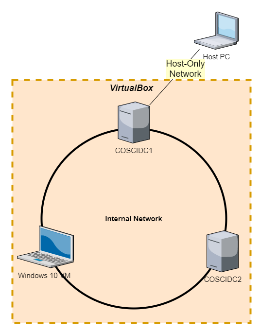

# Routing and Remote Access Service

Routing and Remote Access Service of kort RRAS is een role waarmee een domain controller een netwerk kan routeren als een router met NAT en zo internet providen aan alle devices op het netwerk. Ook hebben we met deze role de mogelijkheid om toegang te krijgen tot het interne netwerk vanop een remote device dat niet deel uitmaakt van hetzelfde netwerk.

In dit lab ga je eerst 'internet' voorzien aan al de virtuele machines op het virtueel netwerk. Daarna ga je een virtual private network (VPN) opzetten om Remote Access te gebruiken.

## 1. Netwerk Infrastructuur

Wat je op dit moment hebt in VirtualBox is het volgende Host-only netwerk, waarop er de VMs en een virtuele router met optionele DHCP server zich bevindt die we in de eerste labs gebruikt hebben. De Host PC zit ook op dit netwerk maar deze hebben we echter niet gebruikt.

In een ideale situatie zonder een VirtualBox zouden we een netwerk willen maken waarbij de primaire server toegang heeft tot het internet en de rol van router en DHCP server op zich neemt. Ook waarbij er geen andere router aanwezig is op het netwerk. Dit netwerk zonder internet verbinding kunnen we bereiken door gebruik te maken van een intern netwerk in VirtualBox waarop alleen de VMs zich dan nog op het netwerk zullen bevinden zonder router of Host PC.

We zouden graag ook met internet verbinding willen werken maar jammer genoeg zitten de VMs geëncapsuleerd in VirtualBox op de Host PC en zal er altijd een tussenstapje gemaakt moeten worden. Met VirtualBox zijn er hiervoor 2 manieren om internet te voorzien naar de VM:

* NAT, met deze optie ga je van de Host PC een NAT router maken, deze routeert het internet naar de VM, verder in dit lab vind je meer over NAT.
* Bridged, met deze optie gaat VirtualBox op de netwerkkaart van de Host PC data injecteren en onderscheppen om zich als een nieuw netwerk interface te gedragen op het internet waarmee jouw Host PC is verbonden. Zowel de Host PC als VM zitten dan op hetzelfde internet netwerk.

Uiteindelijk gaan we voor dit lab toch geen internet verbinding opzetten, omdat we deze niet nodig hebben en omdat internet voorzien aan de VMs enorme performantie problemen veroorzaakt in VirtualBox. Daarom gaan we voor dit lab een middenweg gebruiken. We gaan een Host-only netwerk toevoegen enkel aan de primaire server en we doen alsof de Host PC het internet is om te testen. Als je later toch eens met internet wil testen, kan je gerust een optie van hierboven nemen.

## 2. Internet Toegang

Om internet toegang te krijgen aan alle machines op een netwerk, heb je een router nodig met 2 netwerkkaarten. Eén netwerkkaart in het interne netwerk en de andere in verbinding met het internet. In dit geval ga je de primaire domain controller gebruiken als router, dus je zal deze eerst internet toegang moeten geven door een tweede netwerkkaart toe te voegen.

Als eerste gaan we het Host-only network vervangen met een Internal Network door alle adapters te vervangen op de VMs. Dit doen we omdat we nu niet meer afhankelijk zijn van een router want de primaire domain controller neemt deze taak vanaf nu op.

Dit mag je alvast doen op je VMs, vervang op alle VMs in network settings de adapter voor Host-only network met een InternalNetwork adapter. Zorg ervoor dat deze internal network adapters op hetzelfde netwerk zitten door middel van de naam.

### 2.1. COSCIDC1 Internet Toegang

Om internet toegang te voorzien, of in det geval een verbinding tot de Host PC, moeten we een tweede netwerkkaart toevoegen in VirtualBox aan de VM met je primaire domain controller.

* Zet alle VMs uit
* In VirtualBox > File > Host Network Manager
  * Maak een nieuw netwerk aan
  * Laat alle settings staan zoals ze zijn maar vink DHCP server aan
* Open de settings van je VM
* Ga naar Network
* Enable en maak van Adapter 2 een Host-only adapter en selecteer diegene die je juist hebt aangemaakt
* Zet je VM terug op
* In Server Manager, ga naar adapter settings door te klikken op je IP-adres onder Local Server
  * Open de properties van Ethernet
    * Open IPv4 settings
    * Maak default gateway leeg

Open een CMD window op jouw Host PC en probeer een ping naar het IP-adres van de primaire server op het Host-only netwerk.

### 2.2. RRAS Setup

Het volgende dat je moet doen is van de domain controller een NAT-router maken. NAT of Network address translation is een techniek op routers om IP-adressen te veranderen op IP-pakketen zodat we binnen in het netwerk eigen IP-adressen kunnen uitdelen en gebruiken.

Als bijvoorbeeld Windows 10 VM op het interne netwerk een HTTP pagina wil laden van Google. Dan gebeurt het volgende proces:

1. WIN10 VM stuurt HTTP-request pakket naar NAT-router
2. De NAT-router vervangt het internet IP-adres van de WIN10 met zijn eigen externe IP-adres op het internet en houd bij dat er een HTTP request verstuurd is op een bepaalde poort door een bepaald intern IP-adres
3. Later ontvangt de NAT-router een HTTP-response op diezelfde poort
4. De NAT-router stuurt dit bericht door naar het intern IP-adres dat gelinkt was met deze poort en verwijdert over tijd de link
5. WIN10 ontvangt HTTP-response

Maar zonder vraag kan de webserver bijvoorbeeld niets sturen naar de Windows 10 VM, omdat de NAT tabel enkel wordt ingevuld vanuit vraag van devices op het intern netwerk. Dit wil zeggen dat je vanuit het internet niet aan de devices kan op het interne netwerk tenzij deze eerst een vraag hebben gestuurd met een bepaald protocol.

> Wat je wel kan doen is iets dat men noemt Port-forwarding waarmee je permanent een poort kunnen linken aan een intern IP-adres

Nu ga je een NAT-router opzetten, hiervoor hebben we de RRAS role op de primaire server nodig.

* Manage
* Add Roles and Features
  * Role-based or feature-based intallation
  * Op COSCIDC1
  * Vink `Remote Access` aan, Next
  * Next
  * Vink `DirectAccess and VPN (RAS)` en `Routing` aan
  * Klik verder en Install
* Na installatie open Tools > Routing and Remote Access
  * Rechtermuisklik COSCIDC1 > Configure and Enable Routing and Remote Access
  * Selecteer de optie NAT
  * Selecteer in de lijst welk network interface toegang heeft tot de pc (de 2e)
  * Finish

### 2.3. Default Gateways

Nu dat de domain controller een NAT-router is, kunnen we op andere machines op het netwerk de primaire domain controller als default gateway zetten om zo ook internet toegang te krijgen, of tenminste toegang tot de Host PC.

Maar de Windows 10 VM krijgt zijn TCP/IP settings van de DHCP server COSCIDC1, waaronder de default gateway als optie router. Dit moeten we dus aanpassen in de DHCP Manager.

* Op COSDIDC1, pas in DHCP Manager aan onder scope options van je scope zodat de router option wijst naar jouw COSCIDC1 IP-adres
* Herstart COSCIDC1
* Start je Windows 10 VM op, je zal eventueel `ipconfig /release` & `ipconfig /renew` moeten gebruiken. Om de nieuwe default gateway te krijgen
* Controleer of je internet toegang hebt op je Windows 10 VM met te pingen of surfen naar google

### 2.4. Pings Testen

Eenmaal dat alle routering in orde is kunnen we proberen te pingen van de Windows 10 VM naar onze PC zelf. Dit kan je doen door het IP adressen te gebruiken van `ipconfig` en te pingen met `ping` in een CMD window.

Je PC zal waarschijnlijk geen pings toelaten vanwege dat het Host-only network een publiek netwerk is en Windows Firewall zal network discovery dan tegenhouden. Om dit enkel voor dit bepaald netwerk aan te zetten moet je volgende stappen doen op jouw PC:

* Open Windows Firewall in Windows Settings en klik op Advanced Settings
* Op het overzicht, klik op Windows Defender Firewall Properties
* Ga naar het Public Profile Tab
* Customize Protected network connections
* En zet de vink bij Virtual Host-Only Network uit

Nu kunnen we proberen om te pingen tussen ons internal netwerk en de PC.

* Ping van WIN10 naar COSCIDC1
* Ping van COSCIDC1 naar je PC
* Ping van WIN10 naar je PC
* Ping van je PC naar COSCIDC1

> Wat we nu hebben is nog geen volwaardige internet verbinding, maar enkel een verbinding met de host namelijk de PC. Maar we kunnen hier de Host PC vergelijken alsof dit het internet is.

## 3. Remote Access

Remote verbindingen zijn je gereedschap om je servers op afstand te kunnen beheren. Als je bijvoorbeeld de enige netwerkbeheerder bent in de organisatie, of de enige met toestemming. Dan kan het bijvoorbeeld zijn dat er iets fout loopt met de servers terwijl je thuis zit, of nog erger, als je op vakantie bent in het buitenland. Dan zou het dus heel evident zijn dat je overal ter wereld veilig de server kan beheren.

Er zijn 2 technieken waarmee we zouden kunnen een verbinding maken op afstand. De eerste is een inbelverbinding, waarbij je met een Dial Up methode over een telefoonnet zal verbinding maken met de server. Maar deze techniek is traag, prijzig en makkelijk af te luisteren.

De andere techniek is een VPN-verbinding, deze verbinding is snel, veilig en over het internet. Daarom dat we deze techniek gaan gebruiken om COSCIDC1 op afstand te beheren.

### 3.1. VPN Server

Eerst gaan we RRAS opnieuw moeten configureren om ook VPN's te ondersteunen.

* Open Routing and Remote Access
* Rechtermuisklik op je server > Disable
* Rechtermuisklik COSCIDC1 > Configure and Enable Routing and Remote Access
* Selecteer deze keer de optie VPN en NAT
* Selecteer in de lijst welk network interface toegang heeft tot de pc (de 2e)
* Laat VPN automatisch IP-addressen verzien door middel van DHCP
* No -> geen RADIUS server
* Finish
* Je krijgt een waarschuwing van DHCP Relay agent -> druk Ok

> RADIUS is bedoelt voor grotere netwerken wanneer vele gebruikers toegang wil tot grote aantallen servers vanop afstand. RADIUS is een server die zorgt voor een centraal authenticatie punt voor remote verbindingen. In ons geval hebben we dat niet nodig omdat we maar één remote verbinding willen naar één server.

### 3.2. DHCP Relay Agent

Even toelichten over DHCP Relay Agent. Als je een VPN opzet, wilt deze een IP adres krijgen binnen het intern netwerk van het domein. Maar de client van de VPN zit hoogstwaarschijnlijk niet in datzelfde netwerk maar eerder ergens op afstand en DHCP werkt alleen voor dat intern netwerk. Dus heeft de router COSCIDC1 een protocol om IP-adressen te geven aan clients buiten het netwerk, dit protocol is DHCP Relay Agent.

We moeten deze DHCP Relay Agent echter nog configureren om naar de juiste DHCP server te gaan vragen voor een IP-adres.

* Op Routing and Remote Access
* Klap IPv4 open en je ziet DHCP Relay Agent
* Rechtermuisklik hierop > New Interface ...
* Selecteer het interface met toegang tot de DHCP-server (de 1ste)
* Ok tot het venster sluit
* Rechtermuisklik DHCP Relay Agent > Properties
* Voeg het IP-adres toe van de DHCP server, dit is het intern IP-adres van COSCIDC1 zelf
* Apply en Ok

Ga nu eens kijken naar DHCP Manager en je zal zien, onder COSCIDC1 > Scope > Address leases, dat er nu een heleboel adressen zijn uitgedeeld voor gebruik van toekomstige VPN's.

### 3.3. Authenticatie protocollen

In Routing and Remote Access, rechtermuisklik op COSCIDC1 en ga naar Properties. Navigeer dan naar de tab Security.

Hier zie je dat de huidige authentication provider Windows Authentication is. De andere optie is RADIUS, maar die gaan we niet gebruiken. Open eens Authenitcation Methods en dan zie je welke authenticatie methodes ondersteund worden met vanonder de regel om alles toe te laten. Afhankelijk van wat de client ondersteund, zal de methode hoogst in de deze lijst gebruikt worden.

* EAP (Extensible Authentication Protocol) is een uitbreiding van het PPP-protocol (Point-to-Point Protocol) dat wordt gebruikt voor het rechtstreeks verbinden van twee computers. Met EAP kunnen ook certificaten worden gebruikt.
* MS-CHAP v2 is de nieuwste versie van Microsoft van CHAP (Challenge Handshake Authentication Protocol). Dit protocol werkt alleen op Windows devices.

* CHAP is een protocol dat werkt met het welbekende three-way handshake methode doormiddel van een challenge (username en paswoord encrypteren met een willekeurig getal gegeven door de server).
* PAP (Password Authentication Protocol) is het versturen van username en password in clear tekst. Deze is dus onveilig.

Selecteer enkel EAP en MS-CHAP v2 en druk 2 keer op OK.

### 3.4. VPN-protocollen

Een VPN wordt vaak omschreven als een tunnel tussen een VPN-client en een VPN-server. De tunnel wordt gemaakt met een tunnel-protocol en het dataverkeer door de tunnel wordt versleuteld met een encryptie-protocol. Zo zijn er verschillende VPN-protocollen die een tunnel en/of encryptie protocol zijn en we kunnen sommigen ook combineren.

* PPTP (Point-to-Point Tunneling Protocol) is een tunnel en encryptie protocol. PPTP verpakt IP-packets en versleutelt deze met encryptiesleutels die gegeneerd worden bij authenticatie.
* L2TP (Layer Two Tunneling Protocol) is nieuwer dan PPTP maar is enkel een tunnel protocol. Het voordel van dit tunnel protocol is dat het te combineren is met IPSec dat een encryptie protocol is. Met L2TP/IPSec kan je veilige een VPN maken.
* SSTP (Secure Socket Tunneling Protocol) maakt gebruikt van SSL net zoals HTTPS hier gebruikt van maakt met certificaten. Dit protocol is enkel geschikt voor inkomende verbindingen.
* IKEv2 is een tunnelprotocol die ook samenwerkt met IPSec als encryptie protocol. Met dit protocol blijft de VPN-client intact als deze van internet router wisselt.

Om wat meer perspectief te brengen, kan je de vergelijken zien in de tabel hieronder:

|  | PPTP | L2TP/IPSec | SSTP | IKEv2 |
| :--- | :---: | :---: | :---: | :---: |
| Beveiliging tegen het lezen van data | + | +++ | ++ | +++ |
| Beveiliging tegen het weiziging van data | + | ++ | ++ | ++ |
| Beveiliging bij de authenticatie | + | +++ | ++ | +++ |
| Eenvoud bij het installeren | +++ | - | ++ | - |
| Eenvoud int het gebruik | +++ | - | ++ | - |

Om deze protocollen te configureren kunnen we deze aan of uit zetten doormiddelen van hun poorten te limiteren. Elk tunnelprotocol hierboven heeft poorten nodig. Jij hebt echter 1 poort nodig omdat je maar 1 VPN zal aanmaken en dat gaan we doen met PPTP.

* In Routing and Remote Access
* Rechtermuisklik op Ports > Properties
  * Hier zie elk protocol staan en hoeveel poorten ze elk hebben
* Selecteer PPTP en dan Configure ...
  * Vink alleen `Remote access connections (inbound only)` aan
  * Zet de maximum ports op 1
* Configureer voor alle andere protocollen geen vinken en 0 poorten

* Apply en OK

Als resultaat zal je nog maar 1 poort over hebben in de lijst.

### 3.5. User Dial-in

Tenslotte gaan we in Active Directory Users and Computers een user kiezen waarmee we zullen inloggen met de VPN. Kies hier bijvoorbeeld de Administrator voor, ga naar de eigenschappen en dan naar de tab Dial-in. Op deze tab vink je `Allow Access` aan onder `Network Access Permission` en dan Apply en Ok.

### 3.6. VPN client

De volgende stap is een VPN Client opzetten en kan je doen van eender welk device dat toegang heeft tot jouw COSCIDC1. Via het Host-only network, moet jouw PC toegang hebben tot deze server. Deze stappen zijn voor Windows 10 en doe je best op de Host PC. Voor diegene die niet op een Windows PC werken kunnen dit ook doen met de Windows 10 VM.

* Rechtermuisklik in de taakbalk op je internet rechtsonder en dan op `Network and Sharing Center`. Het kan ook zijn dat je `Open Network and Internet settings` krijgt, vandaar kan je ook verder gaan naar het `Network and Sharing Center`.
* Set up a new connection or network
* Kies `Connect to a workplace`
  

* Use my internet connection (VPN)
  * Indien je geen internet hebt: I'll set up an Internet connection later
* Vul het IP-adres in van COSCIDC1 rekening houden met welk netwerk je aan het verbinden bent. Vanop de PC is dit het adres van NAT, vanop de VM is dit het statische adres. Vink `Remember my credentials` weg.
* Create
* In `Network and Sharing Center` ga naar `Change adapter settings`
* Rechtermuisklik de VPN > Properties
  * Ga naar Security tab
    * Type of VPN: PPTP
    
  * Networking tab
    * Vink IPv6 weg
  * Ok

Nu kan je rechtsonder in taakbalk linksklikken op het internet icon, en connecteer met je VPN. Login met het account waaraan je netwerk toegang hebt gegeven.

Op je primaire server kan je nu ook zien in Routing and Remote Access onder `Remote Access Clients` dat er nu een client verbonden is. Ook bij Ports zie je nu dat de enige poort actief is.

### 3.7. Remote Desktop

Als je met de VPN verbonden bent ben je deel van het interne netwerk. Je kan bijvoorbeeld pingen naar het interne IP-adres van COSCIDC1, zonder VPN zou dat niet werken. Als je nu bijvoorbeeld andere servers of printers had, dan kan je deze ook gebruiken met deze VPN.

Maar om te beheren is dit niet erg praktisch. Hiervoor heb je Remote Desktop, waarmee je rechtstreeks het bureaublad kan zien van de server.

* Op je primaire server in Server Manager onder Local Server, zet Remote Desktop aan door `Allow remote connections tot his computer` aan te vinken.
* In Windows 10, open de applicatie Remote Desktop Connection, Show Options
  * Vul de naam van de primaire server in en je username
  
* Connect

Nu kan je alles wat je zou kunnen indien je op de server zelf zit, maar dan vanop afstand.

## 4. Wat moet je na dit labo kennen/kunnen

* Je kan de werking van een NAT router uitleggen.
* Je kan een NAT router opzetten.
* Je kent de verschillende authenticatie protocollen en welke we best gebruiken.
* Je kent de verschillende tunnel en encryptie protocollen.
* Je kan een VPN server opzetten.
* Je kan een VPN client opzetten.
* Je kan verbinden met Remote Desktop.
