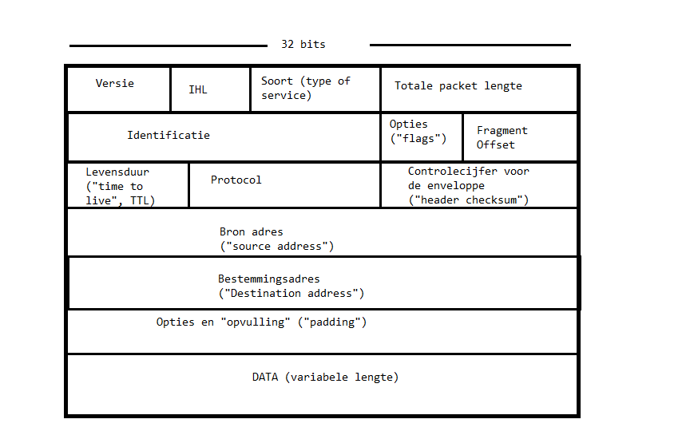
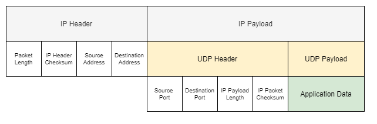
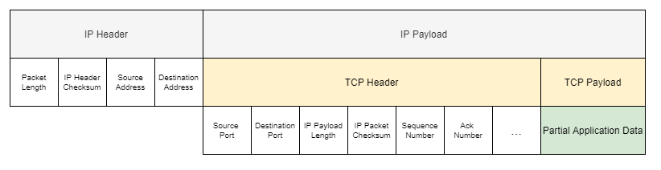
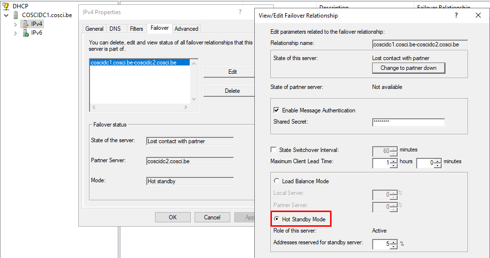

# Wireshark

In dit lab ga je de werking van services zien door naar hun pakketten te kijken. Tijdens dit lab worden er vragen gesteld die je moet beantwoorden voor opdracht 4. We gaan te werk met wireshark, waarmee we de datastroom van een netwerkkaart kunnen inspecteren, filteren en zoeken naar informatie in pakketten.

## 1. Wireshark Setup

Eerst moet je Wireshark op je primaire server installeren, maar je moet aan het internet kunnen om deze te downloaden. Je primaire server zou van het vorige lab nu 2 netwerk adapters moeten hebben: Internal Network adapter en Host-only Network adapter. Met de volgende stappen moeten we dan Wireshark erop kunnen krijgen.

> Voor diegene die in een vorig lab filesharing hebben opgezet, kan je de executable via filesharing op jouw VM zetten zodat je geen internet hoeft te voorzien aan je VM.

- Zet alle VMs uit
- Open de settings van de primaire server VM en vervang de Host-only Network adapter met een NAT adapter zodat je primaire server toegang krijgt tot het internet
- Start de primaire server VM, dit kan lang duren
- In de VM browse naar [https://www.wireshark.org/download/win64](https://www.wireshark.org/download/win64)
- Download `Wireshark-win64-latest.exe`
- De browser zal vragen om `wireshark.org` toe te voegen aan vertrouwde websites, voeg deze toe
- Klik nog eens op de exe als deze nog niet aan het downloaden is
- Voer de executable die je gedownload hebt uit
  - Doorloop het hele installatieproces, pas de default waardes niet aan
- Kijk na of je de app Wireshark kan opstarten
- Schakel de VM uit
- Verander jouw adapter in de VM settings terug naar host-only adapter zodat deze niet meer zo lang moet opstarten de volgende keer

Verder in dit lab maak je voornamelijk gebruik van Wireshark op de primaire server VM. Met Wireshark zal je het netwerk interface `Ethernet` moeten beluisteren om de pakketten te vinden die je nodig hebt voor de opdracht.

## 2. IP Structuur

Voordat we erin vliegen gaan we eens kijken hoe deze pakketten ineen zitten. Een IP-pakket bestaat uit een formatie van een header en data gedeelte die achter elkaar zijn geplaatst. Het data gedeelte noemen we ook wel de payload. De header bestaat uit een reeks velden om het pakket te beschrijven zodat de ontvanger van dit pakket er een structuur kan in terugvinden door het protocol te volgen. Zonder structuur zou dit voor de ontvanger simpelweg een reeks van willekeurige bits zijn waarvan we niet weten hoe lang het pakket is of op welke manier deze moet gelezen worden.

Een IP-pakket heeft geen vaste grootte, maar als ontvanger kan je het pakket inlezen stuk voor stuk. Eerst lees je in hoe groot de header en payload is. Ook of het om IPv4 of IPv6 gaat, zodat je weet dat de bron- en bestemmingsadres 32 bit of 128 bit zijn. Verder kan het pakket nog met metadata en padding (opvulling) gevuld worden. En tenslotte, is het enkel nog de payload inlezen.

Hieronder kan je een goed overzicht ([van Wikipedia](https://nl.wikipedia.org/wiki/Packet_(informatica))) krijgen van wat je in een IPv4 pakket kan vinden in volgorde.

Nu, deze afbeelding zegt niet veel over wat er allemaal inzit. Daarom hieronder ook een tabel zodat je deze velden eens kan bekijken.

| functie | beschrijving | aantal bits |
| ---: | ---: | ---: |
| versie-informatie | in de praktijk of het een IPv4- of IPv6-packet betreft | 4 |
| Internet Header Length | de lengte van de header in veelvouden van 4 bytes | 4 |
| Type of Service | quality of service, gebruikt om pakketjes prioriteit te geven |
| lengte | van het gehele packet in bytes | 16 |
| identificatietag | om een gefragmenteerd packet te reconstrueren | 16 |
| vlaggen | gefragmenteerd of niet, meer fragmenten | 3 |
| fragment-offset | de positie van een fragment in het originele packet | 13 |
| TTL | levensduur | 8 |
| protocol | TCP, UDP of ICMP ... [en meer](https://en.wikipedia.org/wiki/List_of_IP_protocol_numbers) | 8 |
| Header Checksum | controlecijfer | 16 |
| bron-IP-adres | | 32 |
| bestemmingsadres | | 32 |

Het protocol uit de header van het IP pakket beschrijft dan op zijn beurt de structuur binnen in de payload. De meest voorkomende protocollen voor services op de applicatie laag zullen uiteindelijk UDP en TCP zijn, die op hun beurt dus een header en payload zullen hebben binnenin de payload van het IP-pakket.

Een IP-pakket is niet het laagste niveau in het OSI-model. Deze zitten nog ingepakt in protocollen van het datalinklaag. In ons geval zal een IP-pakket in een Ethernet pakket zitten. Het protocol van een datalinklaag wordt dan gebruikt om jouw IP-pakket te versturen op het netwerk van jouw netwerkkaart, de ontvanger zal jouw IP-pakket hier dan terug uithalen. Als de router als gateway de ontvanger is en deze moet doorgeven, dan gaat deze het IP-pakket opnieuw inpakken in het datalink protocol van het volgende netwerk.

### 2.1. UDP Structuur

Het User Datagram Protocol of UDP is het meest eenvoudig protocol bovenop IP om data te versturen van de ene applicatie naar de andere. Ik noem het met opzet *applicatie* vanwege dat er maar één applicatie of service op één bepaalde poort kan luisteren. En UDP is dan uiteindelijk een protocol dat transport voorziet tussen 2 poorten.

De header van UDP is dan ook heel klein, bestaande uit enkel 8 bytes of 64 bits in totaal. In deze header kan je vinden van en naar welke poort dit pakket is verstuurd. En net zoals in het IP-pakket is er een checksum en lengte. Tenslotte, op de 64ste bit bevindt zich dan de payload bestemd voor de applicatie laag.

| bit | functie |
| ---: | :---: |
| 0 | bron poort |
| 16 | bestemmings poort |
| 32 | lengte van UDP header en UDP payload |
| 48 | checksum van het hele pakket |
| 64 | payload |

> Dat UDP bovenop IP, waarin al een veld voor lengte te vinden is, nog eens een veld voor lengte bevat is vreemd. Dit lengte veld is redundant, maar is er nooit uitgehaald omdat UDP gemaakt werd toen IP als onderliggende transport nog geen standaard was.

### 2.2. TCP Structuur

Dan de betrouwbare tegenhanger van UDP namelijk TCP of Transmission Control Protocol. Dit protocol heeft wat meer velden nodig om de SYN-ACK en sequentie functionaliteit erin te bouwen. De enige overeenkomsten tussen de headers van UDP en TCP zijn de velden bron poort, bestemmings poort en een checksum van het hele IP-pakket. Naast deze velden zijn er ook nog optionele velden waardoor de grootte van een TCP-header niet vastligt.

| functie | beschrijving |
| ---: | :---: |
| bron poort | poort van de verstuurder |
| bestemmings poort | poort van de ontvanger |
| sequentie nummer | het laatst verzonden nummer van de verstuurder |
| ack nummer | het laatst ontvangen nummer van de ontvanger |
| data offset | de lengte van de TCP header |
| gereserveerd | wordt niet gebruikt, maar kan in de toekomst voorkomen |
| flags | bits die de status van de TCP connectie weergeven |
| window grootte | de grootte van het ontvangstwindow van de verstuurder |
| checksum | een checksum op het hele IP pakket |
| opties | extra optionele opties met TCP |

## 3. Wireshark Opnames

### 3.1. IP Protocollen

Start een Wireshark opname en filter op UDP, TCP en ICMP. Laat deze even aanstaan tot je een aantal pakketten van elk hebt verzameld, doe terwijl ook eens een ping van de Windows 10 VM naar de primaire server. Uiteindelijk stop je de Wireshark opname.

De volgende vragen moet je invullen op het opdrachtformulier. Kijk naar de headers van IP, UDP, TCP en ICMP. Wat kan je hier allemaal uithalen?

#### IP Opdracht

1. In welk veld in IP kan je het protocol met het protocol-nummer vinden?
2. Welk protocol nummer heeft UDP in IP?
3. Welk protocol nummer heeft TCP in IP?
4. Hoeveel bytes worden er verstuurd binnenin een ICMP payload wanneer je pingt? In welk veld kan je dit terugvinden?
5. Hoeveel bytes worden er verstuurd binnenin een ICMP payload indien je in de opname het commando `ping coscidc1 -l 1024` gebruikt?

### 3.2. DNS

Start een Wireshark opname en filter op DNS. Op jouw Windows 10 VM, doe een query naar jouw domein `cosci.be` met `nslookup cosci.be`. Eenmaal je een antwoord hebt, stop je de Wireshark opname.

> Het kan zijn dat Windows Update van jouw Windows 10 VM hier regelmatig tussenkomt omdat deze opzoek is naar een naam resolutie van Microsoft. Je kan Windows Update uitzetten op Windows 10 in settings of in services.

#### DNS Opdracht

1. Neem een screenshot van je Wireshark opname.
2. Welk protocol rechtstreeks bovenop IP wordt er gebruikt voor deze DNS lookups?
3. Op welke poort werkt DNS? (Dit moet een poort onder 10000 zijn)
4. Waarom denk je dat de DNS client eerst `cosci.be.cosci.be` en daarna pas `cosci.be` vraagt?
5. Wat gebeurt er als je dezelfde opname maakt maar dan met het commando `nslookup cosci.be.` ?
6. Waar kan je TTL vinden van een DNS record in een DNS response?

### 3.3. DNS Zone Transfer

Om DNS zone transfers uit te proberen moeten we enkele DNS zones bijmaken omdat we dit niet gaan kunnen testen met enkel de primaire en secundaire server die `cosci.be` al repliceren via active directory.

- Start de primaire en secundaire server VMs op
- Open DNS manager op de primaire server
  - Rechtermuisklik op Forward Lookup Zones en New Zone
  - Maak deze zone een primary zone maar slaag deze niet op in Active Directory
  - Kies een zone naam die nog niet gebruikt wordt zoals `transfer.cosci.be`
  - Loop verder door de setup tot je zone is aangemaakt
- Rechtermuisklik op de nieuwe zone en dan properties (eventueel refreshen)
  - Ga naar de tab Zone Transfers
  - Allow zone transfers
  - Only to following servers: edit en vul in het adres van de secundaire server (e.g. 10.10.10.3)
  - OK
- Open DNS manager op de secundaire server
  - Rechtermuisklik op Forward Lookup Zones en New Zone
  - Maak deze zone een secondary zone
  - Gebruik dezelfde zone naam als op de primaire server `transfer.cosci.be`
  - Geef het IP-adres in van jouw primaire server (e.g. 10.10.10.2)
  - Loop verder door de setup tot je zone is aangemaakt

In deze wireshark sessie ga je 2 stappen uitvoeren na elkaar, probeer deze 2 stappen te onderscheiden van elkaar in de opname.

- Start een Wireshark opname en filter op DNS.
1. Maak een A record aan op de primaire server in `transfer.cosci.be`.
- Valideer of de secundaire server ook dit record nu heeft.
2. Forceer dan een volledige zone transfer door op de secundaire server gebruik te maken van `Transfer new copy from Master` in DNS manager.
- Stop de wireshark opname.

#### DNS Zone Transfer Opdracht

1. Neem een screenshot van je Wireshark opname.
2. Als je de opname bekijkt, wat denk je dat er gebeurd is in stap 1? Heeft er een volledige zone transfer plaatsgevonden?
3. Welk type DNS queries zijn er gebruikt in stap 1? Waar kan je dat terugvinden?
4. Welk protocol bovenop IP hebben de pakketten van stap 1 gebruikt?
5. Wat is er gebeurt in stap 2? Was dit een volledige zone transfer?
6. Welk type DNS queries zijn er gebruikt in stap 2?
7. Welk protocol bovenop IP hebben de pakketten van stap 2 gebruikt?

### 3.4. DHCP

Met DHCP kan je een IP-adres volledig opnieuw vragen of enkel vernieuwen. Maak een Wireshark opname met een filter op DHCP. Om een volledig nieuw IP-adres aan te vragen kan je gebruik maken van `ipconfig release` en dan `ipconfig renew`. Om te vernieuwen heb je enkel `ipconfig renew` nodig eenmaal je al een IP-adres hebt.

Werkt vernieuwen niet of antwoord de server niet met een ACK? Dan moet je je DHCP server eens nakijken en herinstellen. Jouw DHCP server moet geautoriseerd zijn en de Failover setting moet op `Hot Standby Mode` staan.

- Authorize
  - Open DHCP manager
  - rechtermuisklik op jouw server
  - Authorize
- Hot Standby Mode
  - Open DHCP manager
  - Ga naar de settings van IPv4
  - Ga naar de tab Failover
  - Selecteer de eerste in de lijst en Edit
    - Zet deze vanonder op Hot Standby Mode
    
    - OK (De secundaire server moet hiervoor aanstaan)
  - OK

> Het verschil tussen `Load Balance` modus en `Hot Standby` modus is dat de 2 domain controllers met `Load Balance` het werk eerlijk gaan verdelen. Maar dit heeft ook een neveneffect dat de ene primaire controller niet gaat vernieuwen als de andere die taak op zich heeft genomen, ookal staat die andere uit. Met `Hot Standby` gaat de primaire server de volledige DHCP taak op zich nemen en zal de andere alleen inspringen indien de primaire wegvalt.

#### DHCP Opdracht

1. Neem een screenshot van je Wireshark opname om een volledig nieuw IP-adres aan te vragen.
2. Neem een screenshot van je Wireshark opname om je IP-adres enkel te vernieuwen.
3. Welk protocol bovenop IP wordt er gebruikt voor deze DHCP pakketten?
4. Op welke 2 poorten werkt DHCP? (Dit moeten poorten onder 10000 zijn)
5. Welke merkwaardige IP-adressen worden hier gebruikt die niet binnen het subnet van het netwerk vallen?
6. Voor wat denk je dat deze merkwaardige IP-adressen dienen?
7. In het proces van een volledig nieuw IP-adres aanvragen, in welke stap van DHCP kan je het IP-adres van de client voor het eerst zien?
8. Waar in het DHCP pakket kan je het IP-adres van vraag 7 vinden?

### 3.5. VPN

Start een Wireshark opname. Connecteer met een VPN op jouw Windows 10 VM die je kan terugvinden in lab 8. Vanaf je connectie hebt, wacht een paar seconden en stop dan de Wireshark opname.

De VPN uit lab 8 maakt gebruikt van Point-to-Point Tunneling Protocol of PPTP. PPTP is het protocol waarmee het allemaal van start gaat. Na het connecteren van de VPN met behulp van PPTP schakelt deze connectie over naar een ander protocol.

#### VPN Opdracht

1. PPTP zit niet rechtstreeks bovenop IP, welk protocol zit hier nog tussen?
2. Met welke poort op de server maakt PPTP verbinding?
3. Naar welk protocol, rechtstreeks bovenop IP, schakelt de VPN over? (Het protocol dat hier gezocht wordt zit rechtstreeks bovenop IP; PPP of Point-to-Point Protocol wordt niet gezocht maar zit bovenop het gezochte protocol)
4. Maakt het protocol uit vraag 3 gebruik van TCP, UDP, beide of geen van beide?
5. Gebeurt de authenticatie bovenop PPTP of het protocol uit vraag 3?

> Met vraag 5 kan je het antwoord terugvinden op basis van hoe je de authenticatie van jouw VPN hebt geconfigureerd. Gebruik je EAP? Zoek dan naar EAP. Gebruik je MS-CHAP v2? Zoek dan naar CHAP.

### 3.6. Active Directory

Sign out op jouw Windows 10 VM. Start een Wireshark opname en filter op LDAP. Op jouw Windows 10 VM, sign in met een account op het domein zoals de `COSCI\Administrator`. Wanneer je op het bureaublad bent stop je de opname.

#### AD Opdracht

1. Neem een screenshot van de LDAP pakketten.
2. Op welk protocol bovenop IP werkt LDAP?
3. Achter welke poort zit de LDAP service? (Dit moet een poort onder 10000 zijn)
4. Wat vermoed je dat er aan het gebeuren is op het moment van deze LDAP pakketten als je opmerkt dat deze pakketten SASL GSS-API Integrity data bevat?

## 4. Wat moet je na dit labo kennen/kunnen

- Je begrijpt de velden die je kan terugvinden in IP.
- Je begrijpt de velden die je kan terugvinden in UDP.
- Je begrijpt de velden die je kan terugvinden in TCP.
- Je kan filteren in Wireshark.
- Je kan informatie terugvinden in Wireshark.
